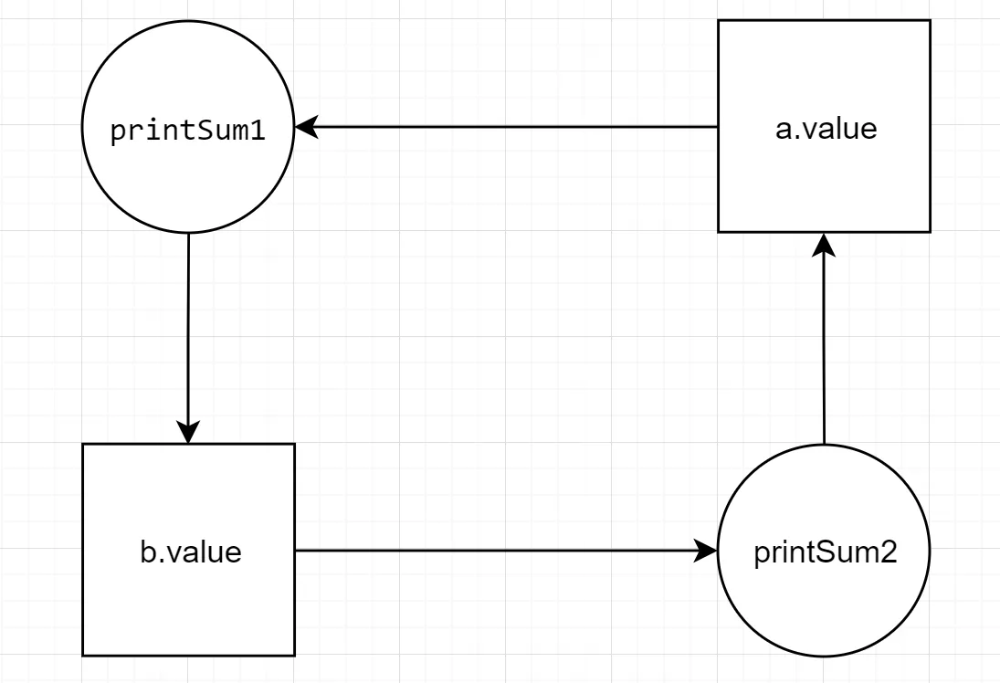

# databases-101

_Добро пожаловать в «Databases 101» — это заметки, охватывающие ключевые концепции баз данных от начального до среднего уровня. Материалы подойдут как новичкам, стремящимся получить прочную базу, так и более опытным пользователям, желающим освежить свои знания. Заметки охватывают такие темы, как SQL-запросы, оптимизация и производительность, транзакции и согласованность данных, и многое другое. Некоторые темы сгруппированы логически для лучшего понимания, а план, представленный ниже, поможет легко ориентироваться в представленных материалах_

## План

### [Введение в базы данных 🗃️](#введение-в-базы-данных)

- [Базы данных и СУБД](#базы-данных-и-субд) // TBD
- [ETL-процессы](#etl-процессы) // TBD
- [ER-диаграмма](#er-диаграмма) // TBD
- [Ключи](#ключи) // TBD
- [Нормализация и денормализация форм](#нормализация-и-денормализация-форм) // TBD
- [Схемы "звезда" и "снежинка"](#схемы-звезда-и-снежинка) // TBD

### [Основы SQL 🧮](#основы-sql)

- [SQL](#sql)
- [SELECT](#select)
- [Агрегатные функции](#агрегатные-функции)
- [WHERE и HAVING](#where-и-having)
- [ORDER BY](#order-by)
- [CASE](#case)
- [Объединения таблиц](#объединения-таблиц)
- [Вложенные запросы](#вложенные-запросы)

### [Расширенные возможности SQL 🚀](#расширенные-возможности-sql)

- [Функции](#функции) // TBD
- [Аналитические функции](#аналитические-функции) // TBD
- [Представления](#представления) // TBD
- [Хранимые процедуры](#хранимые-процедуры) // TBD
- [Триггеры](#триггеры) // TBD

### [Оптимизация и производительность 🔋](#оптимизация-и-производительность)

- [EXPLAIN](#explain) // TBD
- [Индексы](#индексы) // TBD
- [Масштабирование](#масштабирование)
- [Партицирование](#партицирование)
- [Шардинг](#шардинг)
- [Репликация](#репликация)
- [Кэширования](#механизмы-кэширования) // TBD

### [Транзакции и согласованность данных ⏳](#транзакции-и-согласованность-данных)

- [Транзакции](#транзакции)
- [ACID](#acid)
- [Уровни изоляции транзакций](#уровни-изоляции-транзакций)
- [Аномалии](#аномалии)
- [Блокировки](#блокировки)
- [MVCC](#mvcc)
- [SELECT FOR UPDATE и SELECT FOR SHARE](#select-for-update-и-select-for-share)

### [Безопасность 🔐](#безопасность)

- [Управление доступом](#управление-доступом) // TBD
- [Шифрование данных](#шифрование-данных) // TBD
- [Аудит и журналирование](#аудит-и-журналирование) // TBD

### [Дополнительная информация 🗂️](#дополнительная-информация)

- [Архитектура](#архитектура) // TBD
- [Теорема CAP](#теорема-cap)

### [SQL на практике 🙌🏻](#sql-на-практике)

- [Справочники](#справочники)
- [Практические задания](#практические-задания)

## Введение в базы данных

## Основы SQL

### SQL

<details>
<summary>Подробнее</summary>

**SQL** — язык структурированных запросов (SQL, Structured Query Language), который используется в качестве эффективного способа сохранения данных, поиска их частей, обновления, извлечения и удаления из базы данных.

Обращение к реляционным СУБД осуществляется именно благодаря SQL. С помощью него выполняются все основные манипуляции с базами данных, например:

- Извлекать данные из базы данных
- Вставлять записи в базу данных
- Обновлять записи в базе данных
- Удалять записи из базы данных
- Создавать новые базы данных
- Создавать новые таблицы в базе данных
- Создавать хранимые процедуры в базе данных
- Создавать представления в базе данных
- Устанавливать разрешения для таблиц, процедур и представлений

**Диалекты SQL (расширения SQL)**

Язык SQL – универсальный язык для всех реляционных систем управления базами данных, но многие СУБД вносят свои изменения в язык, применяемый в них, тем самым отступая от стандарта. Такие языки называют диалектами или расширениями языка.

Вот некоторые из них:

- **T-SQL** – диалект Microsoft SQL Server
- **PL/SQL** – диалект Oracle Database
- **PL/pgSQL** – диалект PostgreSQL

С точки зрения реализации язык SQL представляет собой набор операторов, которые делятся на определенные группы и у каждой группы есть свое назначение. В сокращенном виде эти группы называются **DDL**, **DML**, **DCL** и **TCL**.

**Группы операторов языка SQL**

**DDL – Data Definition Language**

– это группа операторов определения данных. Другими словами, с помощью операторов, входящих в эту группы, мы определяем структуру базы данных и работаем с объектами этой базы, т.е. создаем, изменяем и удаляем их.

В эту группу входят следующие операторы:

- `CREATE` – используется для создания объектов базы данных;
- `ALTER` – используется для изменения объектов базы данных;
- `DROP` – используется для удаления объектов базы данных.

**DML – Data Manipulation Language**

– это группа операторов для манипуляции данными. С помощью этих операторов мы можем добавлять, изменять, удалять и выгружать данные из базы, т.е. манипулировать ими.

В эту группу входят самые распространённые операторы языка SQL:

- `SELECT` – осуществляет выборку данных;
- `INSERT` – добавляет новые данные;
- `UPDATE` – изменяет существующие данные;
- `DELETE` – удаляет данные.

**DCL – Data Control Language**

– группа операторов определения доступа к данным. Иными словами, это операторы для управления разрешениями, с помощью них мы можем разрешать или запрещать выполнение определенных операций над объектами базы данных.

Сюда входят:

- `GRANT` – предоставляет пользователю или группе разрешения на определённые операции с объектом;
- `REVOKE` – отзывает выданные разрешения;
- `DENY` – задаёт запрет, имеющий приоритет над разрешением.

**TCL – Transaction Control Language**

– группа операторов для управления транзакциями. Транзакция – это команда или блок команд (инструкций), которые успешно завершаются как единое целое, при этом в базе данных все внесенные изменения фиксируются на постоянной основе или отменяются, т.е. все изменения, внесенные любой командой, входящей в транзакцию, будут отменены.

Сюда можно отнести:

- `BEGIN TRANSACTION` – служит для определения начала транзакции;
- `COMMIT TRANSACTION` – применяет транзакцию;
- `ROLLBACK TRANSACTION` – откатывает все изменения, сделанные в контексте текущей транзакции;
- `SAVE TRANSACTION` – устанавливает промежуточную точку сохранения внутри транзакции.

_Больше информации на примере MS SQL можно найти здесь: [Учебник по языку SQL (DDL, DML) на примере диалекта MS SQL Server. Часть первая](https://habr.com/ru/articles/255361/), [Учебник по языку SQL (DDL, DML) на примере диалекта MS SQL Server. Часть вторая](https://habr.com/ru/articles/255523/)_

**Общая структура запроса выглядит следующим образом:**

`SELECT` (столбцы или `*` для выбора всех столбцов; _обязательно_)
`FROM` (таблица; _обязательно_)
`WHERE` (условие/фильтрация, например, `city = Moscow`; _необязательно_)
`GROUP BY` (столбец, по которому хотим сгруппировать данные; _необязательно_)
`HAVING` (условие/фильтрация на уровне сгруппированных данных; _необязательно_)
`ORDER BY` (столбец, по которому хотим отсортировать вывод; _необязательно_)

</details>

### SELECT

<details>
<summary>Подробнее</summary>

`SELECT`, `FROM` — обязательные элементы запроса, которые определяют выбранные столбцы, их порядок и источник данных.

Выбрать все (обозначается как `*`) из таблицы `Customers`:

```sql
SELECT * FROM Customers;
```

Выбрать столбцы `CustomerID`, `CustomerName` из таблицы `Customers`:

```sql
SELECT CustomerID, CustomerName FROM Customers
```

</details>

### Агрегатные функции

<details>
<summary>Подробнее</summary>

**GROUP BY**

`GROUP BY` — необязательный элемент запроса, с помощью которого можно задать агрегацию по нужному столбцу (например, если нужно узнать какое количество клиентов живет в каждом из городов).

При использовании `GROUP BY` обязательно:

- перечень столбцов, по которым делается разрез, был одинаковым внутри `SELECT` и внутри `GROUP BY`,
- агрегатные функции (`SUM`, `AVG`, `COUNT`, `MAX`, `MIN`) должны быть также указаны внутри `SELECT` с указанием столбца, к которому такая функция применяется.

**Описание агрегатных функций**

| Функция               | Описание                         |
| --------------------- | -------------------------------- |
| `SUM`(поле_таблицы)   | Возвращает сумму значений        |
| `AVG`(поле_таблицы)   | Возвращает среднее значение      |
| `COUNT`(поле_таблицы) | Возвращает количество записей    |
| `MIN`(поле_таблицы)   | Возвращает минимальное значение  |
| `MAX`(поле_таблицы)   | Возвращает максимальное значение |

_Агрегатные функции применяются для значений, не равных `NULL`. Исключением является функция `COUNT(*)`_

Группировка количества клиентов по городу:

```sql
SELECT City, count(CustomerID) FROM Customers
GROUP BY City
```

Группировка количества клиентов по стране и городу:

```sql
SELECT Country, City, count(CustomerID) FROM Customers
GROUP BY Country, City
```

Группировка продаж по ID товара с разными агрегатными функциями: количество заказов с данным товаром и количество проданных штук товара:

```sql
SELECT ProductID, COUNT(OrderID), SUM(Quantity) FROM OrderDetails
GROUP BY ProductID
```

Группировка продаж с фильтрацией исходной таблицы. В данном случае на выходе будет таблица с количеством клиентов по городам Германии:

```sql
SELECT City, count(CustomerID) FROM Customers
WHERE Country = 'Germany'
GROUP BY City
```

Переименование столбца с агрегацией с помощью оператора `AS`. По умолчанию название столбца с агрегацией равно примененной агрегатной функции, что далее может быть не очень удобно для восприятия.

```sql
SELECT City, count(CustomerID) AS Number_of_clients FROM Customers
GROUP BY City
```

</details>

### WHERE и HAVING

<details>
<summary>Подробнее</summary>

**WHERE**

`WHERE` — необязательный элемент запроса, который используется, когда нужно отфильтровать данные по нужному условию. Очень часто внутри элемента `WHERE` используются `IN` / `NOT IN` для фильтрации столбца по нескольким значениям, `AND` / `OR` для фильтрации таблицы по нескольким столбцам.

Фильтрация по одному условию и одному значению:

```sql
SELECT * FROM Customers
WHERE City = 'London'
```

Фильтрация по одному условию и нескольким значениям с применением `IN` (включение) или `NOT IN` (исключение):

```sql
SELECT * FROM Customers
WHERE City IN ('London', 'Berlin')
```

```sql
SELECT * FROM Customers
WHERE City NOT IN ('Madrid', 'Berlin','Bern')
```

Фильтрация по нескольким условиям с применением `AND` (выполняются все условия) или `OR` (выполняется хотя бы одно условие) и нескольким значениям:

```sql
SELECT * FROM Customers
WHERE Country = 'Germany' AND City NOT IN ('Berlin', 'Aachen') AND CustomerID > 15
```

```sql
SELECT * FROM Customers
WHERE City IN ('London', 'Berlin') OR CustomerID > 4
```

**HAVING**

`HAVING` — необязательный элемент запроса, который отвечает за фильтрацию на уровне сгруппированных данных (по сути, `WHERE`, но только после группировки результатов - на уровень выше).

Фильтрация агрегированной таблицы с количеством клиентов по городам, в данном случае оставляем в выгрузке только те города, в которых не менее 5 клиентов:

```sql
SELECT City, count(CustomerID) FROM Customers
GROUP BY City
HAVING count(CustomerID) >= 5
```

В случае с переименованным столбцом внутри `HAVING` можно указать как и саму агрегирующую конструкцию `count(CustomerID)`, так и новое название столбца `number_of_clients`:

```sql
SELECT City, count(CustomerID) AS number_of_clients FROM Customers
GROUP BY City
HAVING number_of_clients >= 5
```

Пример запроса, содержащего `WHERE` и `HAVING`. В данном запросе сначала фильтруется исходная таблица по пользователям, рассчитывается количество клиентов по городам и остаются только те города, где количество клиентов не менее 5:

```sql
SELECT City, count(CustomerID) AS number_of_clients FROM Customers
WHERE CustomerName NOT IN ('Around the Horn','Drachenblut Delikatessend')
GROUP BY City
HAVING number_of_clients >= 5
```

</details>

### ORDER BY

<details>
<summary>Подробнее</summary>

**ORDER BY**

`ORDER BY` — необязательный элемент запроса, который отвечает за сортировку таблицы.

Простой пример сортировки по одному столбцу. В данном запросе осуществляется сортировка по городу, который указал клиент:

```sql
SELECT * FROM Customers
ORDER BY City
```

Осуществлять сортировку можно и по нескольким столбцам, в этом случае сортировка происходит по порядку указанных столбцов:

```sql
SELECT * FROM Customers
ORDER BY Country, City
```

По умолчанию сортировка происходит по возрастанию для чисел и в алфавитном порядке для текстовых значений. Если нужна обратная сортировка, то в конструкции `ORDER BY` после названия столбца надо добавить `DESC`:

```sql
SELECT * FROM Customers
ORDER BY CustomerID DESC
```

Обратная сортировка по одному столбцу и сортировка по умолчанию по второму:

```sql
SELECT * FROM Customers
ORDER BY Country DESC, City
```

</details>

### CASE

<details>
<summary>Подробнее</summary>

`CASE` выражение в SQL используется для выполнения условной логики в запросах. Оно позволяет проверять условия и возвращать значение, как только первое условие выполнено. Поэтому как только встречается правдивое условие, чтение останавливается, и возвращается результат.

Существует две формы выражения `CASE`: **простое (simple) CASE** и **поиск с условиями (searched) CASE**.

1. Простое выражение `CASE`
   В этой форме SQL сравнивает выражение с набором возможных значений и возвращает результат первого совпадения.

Синтаксис:

```sql
CASE
    WHEN condition1 THEN result1
    WHEN condition2 THEN result2
    ...
    ELSE default_result
END
```

Пример:

```sql
SELECT
    product_name,
    CASE category_id
        WHEN 1 THEN 'Electronics'
        WHEN 2 THEN 'Books'
        ELSE 'Other'
    END AS category
FROM products;
```

Здесь, в зависимости от category_id, продукту присваивается соответствующая категория.
Если нет совпадений, выполняется условие ELSE, возвращающее 'Other'.

2. Поиск с условиями CASE
   Эта форма позволяет использовать логические условия (например, >, <, =, !=), а не просто сопоставлять выражение с конкретными значениями.

Синтаксис:

```sql
CASE
    WHEN condition1 THEN result1
    WHEN condition2 THEN result2
    ...
    ELSE default_result
END
```

Пример:

```sql
SELECT
    employee_name,
    salary,
    CASE
        WHEN salary > 80000 THEN 'High'
        WHEN salary BETWEEN 50000 AND 80000 THEN 'Medium'
        ELSE 'Low'
    END AS salary_range
FROM employees;
```

Это выражение `CASE` проверяет различные условия для зарплаты и возвращает соответствующий диапазон зарплаты.

**Основные моменты:**

- Условия в блоках `WHEN` проверяются по порядку, и первое, которое возвращает `TRUE`, используется.
- Блок `ELSE` необязателен и задаёт значение по умолчанию, если ни одно условие не выполнено.
- `CASE` часто используется в операторе `SELECT`, но также может применяться в `UPDATE`, `DELETE` и других частях запроса.

</details>

### Объединения таблиц

<details>
<summary>Подробнее</summary>

Объединения таблиц основаны на принципе первичных и вторичных ключей таблиц и являются одной из основ работы реляционных СУБД.

`INNER JOIN`

Cоединение, при котором находятся пары записей из двух таблиц, удовлетворяющие условию соединения, тем самым образуя новую таблицу, содержащую поля из первой и второй исходных таблиц.

`LEFT JOIN`

Соединение, которое возвращает все значения из левой таблицы, соединённые с соответствующими значениями из правой таблицы, если они удовлетворяют условию соединения, или заменяет их на NULL в обратном случае.

`RIGHT JOIN`

Соединение, которое возвращает все значения из правой таблицы, соединённые с соответствующими значениями из левой таблицы, если они удовлетворяют условию соединения, или заменяет их на NULL в обратном случае.

`FULL JOIN`

Соединение, которое выполняет внутреннее соединение записей и дополняет их левым внешним соединением и правым внешним соединением.

**Алгоритм работы полного соединения:**

- Формируется таблица на основе внутреннего соединения (INNER JOIN)
- В таблицу добавляются значения не вошедшие в результат формирования из левой таблицы (LEFT OUTER JOIN)
- В таблицу добавляются значения не вошедшие в результат формирования из правой таблицы (RIGHT OUTER JOIN)

[Базовые запросы для разных вариантов объединения таблиц](https://sql-academy.org/ru/guide/outer-join#bazovye-zaprosy-dlya-raznyh-variantov-obuedineniya-tablic)

<div align="center">
  
  
  
</div>

</details>

### Вложенные запросы

<details>
<summary>Подробнее</summary>

**Вложенный запрос** – это запрос, который находится внутри другого SQL запроса и встроен внутри условного оператора `WHERE`.

Данный вид запросов используется для возвращения данных, которые будут использоваться в основном запросе, как условие для ограничения получаемых данных.

**Правила вложенных запросов**

На вложенный запрос распространяются следующие ограничения:

- Список выбора вложенного запроса, начинающийся с оператора сравнения, может включать только одно выражение или имя столбца (за исключением операторов `EXISTS` и `IN` в инструкции `SELECT *` или в списке соответственно).
- Если предложение `WHERE` внешнего запроса включает имя столбца, оно должно быть совместимо для соединения со столбцом в списке выбора вложенного запроса.
- Типы данных `ntext`, текста и изображения нельзя использовать в списке вложенных запросов.
- Так как они должны возвращать одно значение, вложенные запросы, представленные оператором немодифицированного сравнения (один не следует ключевому слову `ANY` или `ALL`) не могут включать `GROUP BY` и `HAVING` предложения.
- Ключевое `DISTINCT` слово нельзя использовать с вложенными запросами, включающими `GROUP BY`.
- Не `COMPUTE` удается указать предложения и `INTO` предложения.
- Предложение `ORDER BY` может быть указано только вместе с предложением `TOP`.
- Представление, созданное с помощью вложенных запросов, не может быть обновлено.
- Список выбора вложенного запроса, начинающегося с предложения `EXISTS`, по соглашению содержит звездочку `*` вместо отдельного имени столбца. Правила для вложенного запроса, начинающегося с предложения `EXISTS`, являются такими же, как для стандартного списка выбора, поскольку вложенный запрос, начинающийся с предложения `EXISTS`, проводит проверку на существование и возвращает `TRUE` или `FALSE` вместо данных.

_Больше информации с примерами можно найти здесь: [Вложенные запросы (SQL Server)](https://learn.microsoft.com/ru-ru/sql/relational-databases/performance/subqueries?view=sql-server-ver16)_

</details>

## Расширенные возможности SQL

## Оптимизация и производительность

<details>
<summary>Общая информация</summary>

| Область сравнения | Партицирование                | Шардирование        | Репликация                    |
| ----------------- | ----------------------------- | ------------------- | ----------------------------- |
| Основная функция  | Повышение производительности  | Ускорение обработки | Повышение стабильности        |
| Метод             | Разбиение по функциональности | Разбиение по объему | Копирование между серверами   |
| Распределение     | Потоковое                     | Физическое          | По ведущим и ведомым серверам |

</details>

### Масштабирование

<details>
<summary>Подробнее</summary>

**Масштабирование** — это процесс увеличения вычислительных ресурсов системы для обработки больших объемов данных и нагрузки. Масштабирование бывает двух типов:

- Вертикальное масштабирование (Vertical Scaling, Scale-Up): Увеличение мощности одного сервера (например, добавление процессоров, памяти или дисков).

**Преимущества**: Увеличение производительности без необходимости изменения архитектуры системы.

**Недостатки**: Ограничена максимальными возможностями оборудования.

- Горизонтальное масштабирование (Horizontal Scaling, Scale-Out): Добавление большего количества серверов для распределения нагрузки.

**Преимущества**: Легко масштабируется, можно добавлять неограниченное количество серверов.

**Недостатки**: Требует более сложного управления и настройки для поддержания согласованности данных и распределения нагрузки.

_Больше информации можно найти здесь: [Горизонтальное и вертикальное масштабирование инфраструктуры](https://itglobal.com/ru-ru/company/blog/gorizontalnoe-i-vertikalnoe-masshtabirovanie-chto-eto-i-v-chem-raznicza/)_

</details>

### Партицирование

<details>
<summary>Подробнее</summary>

**Разбиение** — это метод распределения данных в таблице на более мелкие части, называемые разделами (partitions). Каждый раздел может храниться отдельно, что помогает оптимизировать производительность запросов и управления данными.

**Цель**: Увеличить скорость выполнения запросов, уменьшить нагрузку на систему и упростить управление данными.

**Типы разбиения**:

- Горизонтальное разбиение (horizontal partitioning) — строки таблицы распределяются по разным разделам.
- Вертикальное разбиение (vertical partitioning) — колонки таблицы распределяются по разным разделам.

**Преимущества**: Быстрая обработка больших наборов данных, эффективное управление данными (например, удаление старых разделов).

**Недостатки**: не поможет в случаях, когда нужно создать бэкап или восстановить из бэкапа, и не освободит место на диске.

_Больше информации с примером партицирования для PostgreSQL можно найти здесь: [Партицирование таблиц в PostgreSQL](https://habr.com/ru/companies/skyeng/articles/583222/)_

</details>

### Шардинг

<details>
<summary>Подробнее</summary>

**Шардинг** — это метод горизонтального разбиения данных на несколько баз данных или серверов (шардов), чтобы уменьшить нагрузку на один сервер и повысить доступность системы. Каждый "шард" хранит уникальный набор данных, которые распределяются по серверам по определенному алгоритму (например, по географическим регионам или по идентификаторам пользователей).

**Цель**: Масштабировать базу данных по мере роста данных и нагрузки на систему, распределяя их на несколько серверов.

**Преимущества**: Обеспечивает горизонтальное масштабирование, снижает нагрузку на один сервер, улучшает отказоустойчивость и скорость доступа к данным.

**Недостатки**: сложность реализации (потеря части данных, повреждения хранилища), возникает риск того, что команда разработчиков будет работать менее эффективно. Несбалансированность данных (какой-то сервер может оказаться более загруженным). Потеря производительности при сложных запросах (одновременно к нескольким шардам).

_Больше информации можно найти здесь: [Шардирование](https://yandex.cloud/ru/docs/glossary/sharding?utm_referrer=https%3A%2F%2Fwww.google.com%2F)_

</details>

### Репликация

<details>
<summary>Подробнее</summary>

**Репликация** — это процесс копирования данных с одного сервера базы данных на другие серверы для повышения доступности данных и отказоустойчивости системы. Реплики данных могут находиться на тех же или на разных серверах, и их можно использовать для распределения нагрузки на чтение, резервного копирования или аварийного восстановления.

**Цель**: Повышение доступности данных, улучшение производительности чтения и обеспечение непрерывной работы при сбоях (failover).

**Типы репликации**:

- Синхронная — изменения данных одновременно применяются ко всем репликам.
- Асинхронная — данные копируются с некоторой задержкой.

**Преимущества**: Обеспечивает высокую доступность, защиту от потери данных, балансировку нагрузки при большом количестве операций чтения.

**Недостатки**: более высокие затраты на хранение дубликатов одних и тех же данных, временные ограничения
при обработке процесса дублирования, сохранение согласованности между репликами данных может увеличить сетевой трафик, несогласованные данные.

_Больше информации можно найти здесь: [Репликация баз данных](https://systems.education/ddia-replication)_

</details>

## Транзакции и согласованность данных

### Транзакции

<details>
<summary>Подробнее</summary>

**Транзакция** — это последовательность операций, выполняемых как единое целое. Если хотя бы одна из операций не удаётся, вся транзакция откатывается, чтобы сохранить согласованность данных. Она защищает данные благодаря принципу «всё, или ничего».

Пример:

В этом примере мы используем транзакцию для обновления статуса заказа и одновременного уменьшения количества товара в таблице `inventory`.

```sql
BEGIN TRANSACTION;
-- обновление таблицы orders
UPDATE orders
SET status = 'shipped'
WHERE order_id = 123;
--обновление таблицы inventory
UPDATE inventory
SET quantity = quantity - 1
WHERE product_id = 456;
COMMIT TRANSACTION;
```

Если оба оператора завершаются успешно, транзакция фиксируется, и изменения в базе данных становятся постоянными.

_Простое объяснение можно найти здесь: [Что такое транзакция](https://habr.com/ru/articles/537594/)_

</details>

### ACID

<details>
<summary>Подробнее</summary>

**Свойства ACID и РСУБД**

Транзакции реляционных баз данных определяются четырьмя основными свойствами: **атомарность**, **согласованность**, **изоляция** и **долговечность**, которые обычно обозначаются аббревиатурой **ACID** и обеспечивают надежность и согласованность транзакций в системах управления базами данных.

- **Неразрывность** или **атомарность** определяет все элементы, которые необходимы для совершения транзакции в базе данных - каждая транзакция либо полностью выполняется, либо полностью откатывается.
- **Согласованность** или **целостность** определяет правила сохранения состояния данных после выполнения транзакции - транзакция приводит базу данных из одного согласованного состояния в другое.
- **Изолированность** гарантирует, что во избежание путаницы транзакция не повлияет на другие элементы до окончательного сохранения изменений - одновременное выполнение транзакций не должно влиять на их результат.
- **Неизменность** или **долговечность** обеспечивает неизменность данных после сохранения изменений в результате транзакции - после завершения транзакции её результаты должны быть сохранены даже в случае сбоя системы.

</details>

### Уровни изоляции транзакций

<details>
<summary>Подробнее</summary>

**Уровни изоляции**

Уровни изоляции определяют, как транзакции взаимодействуют друг с другом, и сколько "грязных" данных они могут видеть или изменять. Существует четыре основных уровня изоляции:

**Serializable (Сериализуемый)**:

- Описание: Самый высокий уровень изоляции.
- Преимущества: Предотвращает все типы аномалий (грязное чтение, неповторяющееся чтение, фантомное чтение).
- Недостатки: Может значительно снизить производительность, так как транзакции фактически выполняются последовательно.

**Repeatable Read (Повторяемое чтение)**:

- Описание: Гарантирует, что данные, прочитанные транзакцией, не изменятся до её завершения.
- Преимущества: Предотвращает грязное чтение и неповторяющееся чтение.
- Недостатки: Не предотвращает фантомное чтение.

**Read Committed (Фиксированное чтение)**:

- Описание: Транзакция читает только зафиксированные данные.
- Преимущества: Предотвращает грязное чтение.
- Недостатки: Не предотвращает неповторяющееся чтение и фантомное чтение.

**Read Uncommitted (Нефиксированное чтение)**:

- Описание: Самый низкий уровень изоляции. Транзакция может читать незавершённые (не зафиксированные) данные других транзакций.
- Преимущества: Наивысшая производительность.
- Недостатки: Возможны все типы аномалий (грязное чтение, неповторяющееся чтение, фантомное чтение).

**Управление транзакциями**

Управление транзакциями включает в себя методы и техники для обеспечения выполнения транзакций в соответствии с ACID-свойствами. Это может включать:

- Начало транзакции: Создание новой транзакции.
- Фиксация транзакции (COMMIT): Сохранение всех изменений, сделанных в рамках транзакции.
- Откат транзакции (ROLLBACK): Отмена всех изменений, сделанных в рамках транзакции.
- Журналирование (Logging): Запись всех операций, выполненных в рамках транзакции, для возможности восстановления в случае сбоя.

_Больше информации можно найти здесь: [Уровни изоляции транзакций с примерами на PostgreSQL](https://habr.com/ru/articles/317884/), [Уровни изолированности транзакций для самых маленьких](https://habr.com/ru/articles/469415/)_

</details>

### Аномалии

<details>
<summary>Подробнее</summary>

**Аномалии** при транзакциях в контексте баз данных и систем управления транзакциями — это ситуации, когда происходит нарушение согласованности и целостности данных.

**Основные типы аномалий включают:**

- **Потерянное обновление (Lost Update)**: Происходит, когда два или более транзакций пытаются одновременно обновить одну и ту же запись. В результате одно из обновлений может быть потеряно.

```sql
-- Транзакция 1
UPDATE accounts SET balance = balance - 100 WHERE account_id = 1;

-- Транзакция 2
UPDATE accounts SET balance = balance + 200 WHERE account_id = 1;
```

- **Грязное чтение (Dirty Read)**: Происходит, когда одна транзакция читает данные, которые были изменены другой транзакцией, но еще не зафиксированы. Если другая транзакция откатывается, данные, считанные первой транзакцией, окажутся неверными.

```sql
-- Транзакция 1
UPDATE accounts SET balance = balance - 100 WHERE account_id = 1;
-- Не фиксируем изменения

-- Транзакция 2
SELECT balance FROM accounts WHERE account_id = 1;
-- Читает измененный баланс
```

- **Неповторяющееся чтение (Non-repeatable Read)**: Происходит, когда данные, прочитанные транзакцией, изменяются другой транзакцией до завершения первой транзакции. В результате первая транзакция видит разные данные при повторном чтении.

```sql
-- Транзакция 1
SELECT balance FROM accounts WHERE account_id = 1;
-- Читает баланс

-- Транзакция 2
UPDATE accounts SET balance = balance + 200 WHERE account_id = 1;
COMMIT;

-- Транзакция 1
SELECT balance FROM accounts WHERE account_id = 1;
-- Читает измененный баланс
```

- **Фантомное чтение (Phantom Read)**: Происходит, когда одна транзакция несколько раз выполняет один и тот же запрос, и между этими запросами другая транзакция добавляет или удаляет строки, соответствующие этому запросу. В результате первая транзакция получает разные наборы строк.

```sql
-- Транзакция 1
SELECT * FROM accounts WHERE balance > 1000;
-- Получает набор строк

-- Транзакция 2
INSERT INTO accounts (account_id, balance) VALUES (3, 1500);
COMMIT;

-- Транзакция 1
SELECT * FROM accounts WHERE balance > 1000;
-- Получает другой набор строк
```

Для предотвращения этих аномалий используются различные уровни изоляции транзакций (Read Uncommitted, Read Committed, Repeatable Read, Serializable). Более высокий уровень изоляции обеспечивает большую защиту от аномалий, но может снижать производительность системы.

</details>

### Блокировки

<details>
<summary>Подробнее</summary>

Для обеспечения согласованности данных в случае одновременного обращения к данным несколькими пользователями, СУБД применяют **блокировки**. Блокировки играют важную роль в обеспечении свойств транзакции ACID. Различные команды `SELECT`, DML и DDL генерируют блокировки на ресурсы. Например, в процессе обновления строки таблицы накладывается блокировка, гарантирующая, что те же самые данные не могут читаться или модифицироваться в то же время. Это обеспечивает чтение и модификацию только зафиксированных данных в базе данных. Последующее обновление может иметь место после первоначального, не они не могут конкурировать. Каждая транзакция должна полностью завершиться или откатиться, никаких полумер.

Следует отметить, что уровни изоляции могут оказывать влияние на поведение чтения и записи, но так описанное выше обычно работает, когда используется уровень изоляции по умолчанию.

Блокировка имеет несколько разных **свойств**: длительность блокировки, режим блокировки и гранулярность блокировки. Длительность блокировки - это период времени, в течение которого ресурс удерживает определенную блокировку. Длительность блокировки зависит, среди прочего, от режима блокировки и выбора уровня изоляции.

**Гранулярность блокировок**

- Табличные:
  Блокируют всю таблицу.
  Примеры: таблицы в реляционных базах данных.

- Строчные:
  Блокируют отдельные строки в таблице.
  Более гранулярный контроль, но может потребоваться больше управляемых ресурсов.

- Страничные:
  Блокируют страницы данных в таблице.
  Используются в некоторых системах для лучшего баланса между производительностью и изоляцией.

**Типы блокировок**

**Shared Lock (S-лок)**:

- Позволяет нескольким транзакциям читать данные одновременно, но запрещает запись.
- Используется для операций чтения, где данные не должны изменяться до завершения чтения.

**Exclusive Lock (X-лок)**:

- Запрещает другим транзакциям как чтение, так и запись данных.
- Используется для операций записи, чтобы данные не были изменены другими транзакциями до завершения записи.

**Intent Locks (I-локи)**:

- Используются для обозначения намерений транзакции получить блокировку на более низком уровне гранулярности.

Типы: Intent Shared (IS), Intent Exclusive (IX), and Shared Intent Exclusive (SIX) обеспечивают иерархию блокировок, что позволяет избежать дедлоков.

Пример использования эксклюзивной и общей блокировок:

```sql
BEGIN TRANSACTION;

-- Установка эксклюзивной блокировки на строку
UPDATE accounts
SET balance = balance - 100
WHERE account_id = 1;

-- Установка общей блокировки на строку
SELECT balance
FROM accounts WITH (HOLDLOCK)
WHERE account_id = 2;

COMMIT TRANSACTION;
```

**Взаимоблокировка (deadlock)** - это особая проблема одновременного конкурентного доступа, в которой две транзакции блокируют друг друга. В частности, первая транзакция блокирует объект базы данных, доступ к которому хочет получить другая транзакция, и наоборот. (В общем, взаимоблокировка может быть вызвана несколькими транзакциями, которые создают цикл зависимостей.) В этом состоянии программа никогда не восстановится без вмешательства извне.

Система баз данных обрабатывает взаимоблокировку, выбирая одну из транзакций (на самом деле, транзакцию, которая замыкает цикл в запросах блокировки) в качестве "жертвы" и выполняя ее откат. После этого выполняется другая транзакция. Это далеко от идеала, приводит к исключениям и может означать, что некоторые данные, предназначенные для вашей базы данных, никогда в неё не попадут.

Есть несколько условий, которые должны присутствовать для возникновения взаимных блокировок (условия Кофмана) - основа для методов, которые помогают обнаруживать, предотвращать и исправлять взаимные блокировки.

**Условия Коффмана**

1. **Условие взаимного исключения**. Каждый ресурс в данный момент или отдан ровно одному процессу, или доступен.
2. **Условие удержания и ожидания**. Процессы, в данный момент удерживаю­щие полученные ранее ресурсы, могут запрашивать новые ресурсы.
3. **Условие отсутствия принудительной выгрузки ресурса**. У процесса нельзя принудительным образом забрать ранее полученные ресурсы. Процесс, владеющий ими, должен сам освободить ресурсы.
4. **Условие циклического ожидания**. Должна существовать круговая последовательность из двух и более процессов, каждый из которых ждет доступа к ресурсу, удерживаемому следующим членом последовательности.

Указанные условия являются необходимыми. То есть, если хоть одно из них не выполняется, то взаимных блокировок никогда не возникнет.

**Диаграммы Холта (Holt)**

Отслеживать возникновение взаимных блокировок удобно на диаграммах Холта (Holt). Диаграмма Холта представляет собой направленный граф, имеющий два типа узлов: процессы (показываются кружочками) и ресурсы (показываются квадратиками). Тот факт, что ресурс получен процессом и в данный момент занят этим процессом, указывается ребром (стрелкой) от ресурса к процессу. Ребро, направленное от процесса, к ресурсу, означает, что процесс в данный момент блокирован и находится в состоянии ожидания доступа к соответствующему ресурсу.



Дедлок имеет место быть, тогда и только тогда, когда диаграмма Холта, отражающая состояния процессов и ресурсов, содержит цикл.

СУБД включает механизмы для обнаружения и разрешения дедлоков. Один из подходов - построение графа ожидания (wait-for graph) и выявление циклов в этом графе.

Чтобы предотвратить долгие ожидания, могут использоваться тайм-ауты для блокировок. Если транзакция не может получить блокировку в течение определенного времени, она может быть прервана.

**Динамический тупик (Livelock)**

Лайвлок - это программы, которые активно выполняют параллельные операции, но эти операции никак не влияют на продвижение состояния программы вперед, т.е. это ситуация, в которой два или более процессов непрерывно изменяют свои состояния в ответ на изменения в других процессах без какой-либо полезной работы. Это похоже на дедлок, но разница в том, что процессы становятся “вежливыми” и позволяют другим делать свою работу.

Выполнение алгоритмов поиска удаления взаимных блокировок может привести к livelock — взаимная блокировка образуется, сбрасывается, снова образуется, снова сбрасывается и так далее.

Лайвлок - это подмножество более широкого набора проблем, называемых голоданием.

**Голодание (Starvation)**

Голодание — это любая ситуация, когда параллельный процесс не может получить все ресурсы, необходимые для выполнения его работы.

При лайвлоке все параллельные процессы одинаково “голодают”, и никакая работа не выполняется до конца.

В более широком смысле голодание обычно подразумевает наличие одного или нескольких параллельных процессов, которые несправедливо мешают одному или нескольким другим параллельным процессам выполнять работу настолько эффективно, насколько это возможно.

**Управление Локами**

**Lock Manager**:

Компонент системы управления базами данных (СУБД), который управляет всеми запросами на блокировки. Обрабатывает запросы на блокировки и освобождение блокировок, разрешает конфликты, и управляет очередями ожидания.

Блокировки играют ключевую роль в обеспечении целостности данных и изоляции транзакций, особенно в многопользовательских системах.

_Больше информации можно найти здесь: [Блокировки](https://professorweb.ru/my/sql-server/2012/level3/3_15.php), [Блокировки в PostgreSQL: 1. Блокировки отношений](https://habr.com/ru/companies/postgrespro/articles/462877/), [Блокировки в PostgreSQL: 2. Блокировки строк](https://habr.com/ru/companies/postgrespro/articles/463819/), [Блокировки в PostgreSQL: 3. Блокировки других объектов](https://habr.com/ru/companies/postgrespro/articles/465263/), [Блокировки в PostgreSQL: 4. Блокировки в памяти](https://habr.com/ru/companies/postgrespro/articles/466199/)_

</details>

### MVCC

<details>
<summary>Подробнее</summary>

**MVCC (Multi-Version Concurrency Control)** — это механизм управления параллелизмом в базах данных, который позволяет нескольким транзакциям читать и записывать данные одновременно, не блокируя друг друга. Это особенно полезно для повышения производительности в системах с высокой степенью параллелизма.

**Основные принципы MVCC:**

- Множество версий данных: При каждом изменении строки данных создается новая версия этой строки, а старая версия сохраняется до тех пор, пока активны транзакции, которые могут её видеть. Это позволяет транзакциям читать данные, которые были актуальны на момент их начала, даже если параллельные транзакции вносят изменения.
- Изоляция транзакций: MVCC позволяет добиться изоляции транзакций без блокировки данных для чтения. Это достигается за счет того, что каждая транзакция видит свою "срез" данных на момент начала.
- Параллелизм:
  - Чтение: Транзакции могут читать данные, не блокируя другие транзакции, поскольку каждая транзакция видит свою версию данных.
  - Запись: Когда транзакция обновляет данные, создается новая версия строки. Таким образом, параллельные транзакции могут читать старые версии строки, не ожидая завершения записи.

**Преимущества:**

- Повышенная производительность за счет устранения блокировок на чтение.
- Повышенная масштабируемость для систем с большим количеством параллельных транзакций.

**Недостатки:**

- Необходимость управления множеством версий данных, что может увеличить объем хранимой информации.
- Старые версии данных нужно периодически очищать (garbage collection), чтобы не перегружать систему.

**Пример работы MVCC:**

_Представим, что транзакция T1 начала читать данные, когда значение в строке было 100. Затем транзакция T2 обновляет эту строку до 200. Транзакция T1 продолжает видеть значение 100, потому что это значение было актуально на момент её начала. В то же время транзакция T3, которая началась позже, видит новое значение 200_

Таким образом MVCC обеспечивает возможность работы с разными версиями данных в зависимости от времени начала транзакции.

_Больше информации можно найти здесь: [Newbie Guide: разбираемся с MVCC на простых примерах](https://habr.com/ru/companies/vk/articles/740108/)_

_Или в официальной документации (например, для PostgreSQL) (en): [Chapter 9. Multi-Version Concurrency Control](https://www.postgresql.org/docs/7.1/mvcc.html)_

</details>

### SELECT FOR UPDATE и SELECT FOR SHARE

<details>
<summary>Подробнее</summary>

В SQL конструкции **SELECT FOR UPDATE** и **SELECT FOR SHARE** используются для управления параллелизмом в транзакциях и блокировки строк, чтобы предотвратить конкурентные изменения данных. Эти команды важны для обеспечения целостности данных в многопользовательских системах.

**SELECT FOR UPDATE**

используется для получения строк с их эксклюзивной блокировкой. Это означает, что строки, выбранные в запросе, будут заблокированы для изменений другими транзакциями до тех пор, пока текущая транзакция не завершится (с помощью `COMMIT` или `ROLLBACK`).

Только транзакция, которая выполнила `SELECT FOR UPDATE`, может изменять заблокированные строки. Другие транзакции не могут изменить или даже прочитать строки с блокировкой до завершения транзакции.

**Применение**: Это полезно, когда планируется обновить строки после их выбора, чтобы другие транзакции не могли изменять или удалять те же данные до завершения текущей транзакции.

Пример:

```sql
BEGIN;
SELECT * FROM employees WHERE department = 'Sales' FOR UPDATE;
-- Теперь строки, которые принадлежат отделу Sales, заблокированы.
-- Продолжаем работу с этими строками.
UPDATE employees SET salary = salary * 1.05 WHERE department = 'Sales';
COMMIT;
```

В этом примере транзакция сначала выбирает сотрудников отдела 'Sales' и блокирует эти строки для дальнейшего обновления. Другие транзакции не могут изменять или удалять эти строки до завершения транзакции.

**SELECT FOR SHARE**

используется для получения строк с "разделяемой" блокировкой, что означает, что другие транзакции могут также читать эти строки, но не могут их изменять или удалять до завершения текущей транзакции.

Никто не может изменять или удалять строки, которые были выбраны с помощью `SELECT FOR SHARE`, пока текущая транзакция не завершится.

**Применение**: Используется, когда нужно только прочитать данные, но необходимо убедиться, что эти данные не будут изменены другими транзакциями до завершения работы.

Пример:

```sql
BEGIN;
SELECT * FROM products WHERE category = 'Electronics' FOR SHARE;
-- Чтение данных, но блокировка на изменение этих строк другими транзакциями.
-- В другой транзакции не удастся выполнить UPDATE или DELETE этих строк до завершения текущей транзакции.
COMMIT;
```

В этом примере транзакция читает строки из таблицы 'products', блокируя возможность их изменения другими транзакциями. Однако другие транзакции могут продолжать читать эти данные.

**Различия:**

- `FOR UPDATE`: Блокирует строки для всех транзакций, кроме текущей. Только текущая транзакция может изменять данные.
- `FOR SHARE`: Разрешает другим транзакциям читать строки, но не позволяет изменять или удалять их.
- Обе конструкции помогают управлять параллельными изменениями данных и предотвращать состояния гонки (race conditions).

</details>

## Безопасность

## Дополнительная информация

### Теорема CAP

<details>
<summary>Подробнее</summary>

**Теорема CAP** (известная также как **теорема Брюера**) — эвристическое утверждение о том, что в любой реализации распределённых вычислений возможно обеспечить не более двух из трёх следующих свойств:

- **согласованность данных** (англ. consistency) — во всех вычислительных узлах в один момент времени данные не противоречат друг другу;
- **доступность** (англ. availability) — любой запрос к распределённой системе завершается откликом, однако без гарантии, что ответы всех узлов системы совпадают;
- **устойчивость к фрагментации** (англ. partition tolerance) — расщепление распределённой системы на несколько изолированных секций не приводит к некорректности отклика от каждой из секций.

<div align="center">
  
</div>

_Концепция NoSQL, в рамках которой создаются распределённые нетранзакционные системы управления базами данных, зачастую использует этот принцип в качестве обоснования неизбежности отказа от согласованности данных. Однако многими учёными и практиками теорема CAP критикуется за вольность трактовки и даже недостоверность в том смысле, в котором она распространена в сообществе._

**Следствия**

С точки зрения теоремы CAP, распределённые системы вычислений в зависимости от пары практически поддерживаемых свойств из трёх возможных распадаются на три класса — **CA**, **CP**, **AP** (при этом в рамках одной программной системы могут быть реализованы стратегии обработки различных запросов с использованием различных систем вычислений).

- В системе вычислений **класса CA** во всех узлах данные согласованы и обеспечена доступность, при этом она жертвует устойчивостью к распаду на секции. Такие системы возможны на основе технологического программного обеспечения, поддерживающего транзакционность в смысле ACID, примерами реализации таких систем вычислений могут быть решения на основе кластерных систем управления базами данных или распределённая служба каталогов LDAP.
- Система вычислений **класса CP** в каждый момент обеспечивает целостный результат и способна функционировать в условиях распада, но достигает этого в ущерб доступности: может не выдавать отклик на запрос. Устойчивость к распаду на секции требует обеспечения дублирования изменений во всех узлах программной системы, реализующей данную систему вычислений, в связи с этим отмечается практическая целесообразность использования в таких системах распределённых пессимистических блокировок для сохранения целостности.
- В системе вычислений **класса AP** не гарантируется целостность, но при этом выполнены условия доступности и устойчивости к распаду на секции. Хотя реализации систем вычислений такого рода известны задолго до формулировки принципа CAP (например, распределённые веб-кэши или DNS), рост популярности решений с этим набором свойств связывается именно с распространением теоремы CAP. Так, большинство NoSQL-систем принципиально не гарантируют целостности данных, и ссылаются на теорему CAP как на мотив такого ограничения. Задачей при построении AP-систем становится обеспечение некоторого практически целесообразного уровня целостности данных, в этом смысле про AP-системы говорят как о «целостных в конечном итоге» (англ. eventually consistent) или как о «слабо целостных» (англ. weak consistent).

**BASE-архитектура**

Во второй половине 2000-х годов сформулирован подход к построению распределённых систем, в которых требования целостности и доступности выполнены не в полной мере, названый акронимом **BASE** (от англ. Basically Available, Soft-state, Eventually consistent — базовая доступность, неустойчивое состояние, согласованность в конечном счёте), при этом такой подход напрямую противопоставляется ACID.

- Под **базовой доступностью** подразумевается такой подход к проектированию приложения, чтобы сбой в некоторых узлах приводил к отказу в обслуживании только для незначительной части сессий при сохранении доступности в большинстве случаев.
- **Неустойчивое состояние** подразумевает возможность жертвовать долговременным хранением состояния сессий (таких как промежуточные результаты выборок, информация о навигации, контексте), при этом концентрируясь на фиксации обновлений только критичных операций.
- **Согласованности в конечном счёте**, трактующейся как возможность противоречивости данных в некоторых случаях, но при обеспечении согласования в практически обозримое время, посвящено значительное количество самостоятельных исследований.

_Больше информации с примерами систем можно найти здесь: [Всё, что вы не знали о CAP теореме](https://habr.com/ru/articles/328792/)_

</details>

## SQL на практике

[SQL style guide](https://github.com/treffynnon/sqlstyle.guide)

### Справочники

<details>
<summary>Подробнее</summary>

#### EN

- [W3 Schools](https://www.w3schools.com/sql/default.asp)
- [SQL Problems and solutions](http://sql-tutorial.ru/en/content.html)

#### RU

- [Интерактивный курс по SQL](https://sql-academy.org/ru/guide)
- [Справочник по функциям SQL](https://sql-academy.org/ru/handbook)
- [SQL Задачи и решения](http://sql-tutorial.ru/ru/content.html)

</details>

### Практические задания

<details>
<summary>Подробнее</summary>

#### EN

- [W3 Schools Exercises](https://www.w3schools.com/sql/sql_exercises.asp)
- [SQLBolt: Interactive Tutorial](https://sqlbolt.com/)
- [SQL exercises](https://sql-ex.ru/learn_exercises.php)

#### RU

- [SQL тренажёр](https://sql-academy.org/ru/trainer)
- [Интерактивный тренажер по SQL](https://stepik.org/course/63054/info)
- [Упражнения по SQL](https://sql-ex.ru/learn_exercises.php?LN=1)

</details>
