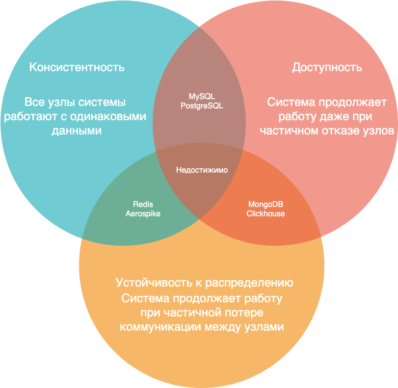

# databases-101

_Добро пожаловать в «Databases 101» — это подробные заметки, охватывающие ключевые концепции баз данных от начального до среднего уровня. Материалы подойдут как новичкам, стремящимся получить прочную базу, так и более опытным пользователям, желающим освежить свои знания. Заметки охватывают такие темы, как SQL-запросы, оптимизация и производительность, транзакции и согласованность данных, и многое другое. Некоторые темы сгруппированы логически для лучшего понимания, а план, представленный ниже, поможет легко ориентироваться в представленных материалах._

## План

<details>
  <summary>Открыть полный план</summary>

### Введение в базы данных

- [Базы данных и СУБД](#базы-данных-и-субд) // TBD
- [ETL-процессы](#etl-процессы) // TBD
- [ER-диаграмма](#er-диаграмма) // TBD
- [Ключи](#ключи) // TBD
- [Нормализация и денормализация форм](#нормализация-и-денормализация-форм) // TBD
- [Схемы "звезда" и "снежинка"](#схемы-звезда-и-снежинка) // TBD

### Основы SQL

- [T-SQL](#t-sql) // TBD
- [SELECT](#select) // TBD
- [Агрегатные функции](#агрегатные-функции) // TBD
- [WHERE и HAVING](#where-и-having) // TBD
- [CASE](#case)
- [Объединения таблиц](#объединения-таблиц) // TBD
- [Вложенные запросы](#вложенные-запросы) // TBD

### Расширенные возможности SQL

- [Функции](#функции) // TBD
- [Аналитические функции](#аналитические-функции) // TBD
- [Представления](#представления) // TBD
- [Хранимые процедуры](#хранимые-процедуры) // TBD
- [Триггеры](#триггеры) // TBD

### Оптимизация и производительность

- [EXPLAIN](#explain) // TBD
- [Индексы](#индексы) // TBD
- [Масштабирование](#масштабирование)
- [Партицирование](#партицирование)
- [Шардинг](#шардинг)
- [Репликация](#репликация)
- [Кэширования](#механизмы-кэширования) // TBD

### Транзакции и согласованность данных

- [Транзакции](#транзакции) // TBD
- [ACID](#acid)
- [Уровни изоляции транзакций](#уровни-изоляции-транзакций) // TBD
- [Аномалии](#аномалии) // TBD
- [Локи](#локи) // TBD
- [MVCC](#mvcc) // TBD
- [SELECT FOR UPDATE и SELECT FOR SHARE](#select-for-update-и-select-for-share) // TBD

### Безопасность

- [Управление доступом](#управление-доступом) // TBD
- [Шифрование данных](#шифрование-данных) // TBD
- [Аудит и журналирование](#аудит-и-журналирование) // TBD

### Дополнительная информация

- [Архитектура](#архитектура) // TBD
- [Теорема CAP](#теорема-cap)

### SQL на практике

- [Справочники](#справочники)
- [Практические задания](#практические-задания)

</details>

## Введение в базы данных

## Основы SQL

### CASE

<details>
<summary>Подробнее</summary>

CASE выражение в SQL используется для выполнения условной логики в запросах. Оно позволяет проверять условия и возвращать значение, как только первое условие выполнено. Поэтому как только встречается правдивое условие, чтение останавливается, и возвращается результат.

Существует две формы выражения CASE: **простое (simple) CASE** и **поиск с условиями (searched) CASE**.

1. Простое выражение CASE
   В этой форме SQL сравнивает выражение с набором возможных значений и возвращает результат первого совпадения.

Синтаксис:

```sql
CASE
    WHEN condition1 THEN result1
    WHEN condition2 THEN result2
    ...
    ELSE default_result
END
```

Пример:

```sql
SELECT
    product_name,
    CASE category_id
        WHEN 1 THEN 'Electronics'
        WHEN 2 THEN 'Books'
        ELSE 'Other'
    END AS category
FROM products;
```

Здесь, в зависимости от category_id, продукту присваивается соответствующая категория.
Если нет совпадений, выполняется условие ELSE, возвращающее 'Other'.

2. Поиск с условиями CASE
   Эта форма позволяет использовать логические условия (например, >, <, =, !=), а не просто сопоставлять выражение с конкретными значениями.

Синтаксис:

```sql
CASE
    WHEN condition1 THEN result1
    WHEN condition2 THEN result2
    ...
    ELSE default_result
END
```

Пример:

```sql
SELECT
    employee_name,
    salary,
    CASE
        WHEN salary > 80000 THEN 'High'
        WHEN salary BETWEEN 50000 AND 80000 THEN 'Medium'
        ELSE 'Low'
    END AS salary_range
FROM employees;
```

Это выражение CASE проверяет различные условия для зарплаты и возвращает соответствующий диапазон зарплаты.

**Основные моменты:**

- Условия в блоках WHEN проверяются по порядку, и первое, которое возвращает TRUE, используется.
- Блок ELSE необязателен и задаёт значение по умолчанию, если ни одно условие не выполнено.
- CASE часто используется в операторе SELECT, но также может применяться в UPDATE, DELETE и других частях запроса.

</details>

## Расширенные возможности SQL

## Оптимизация и производительность

<details>
<summary>Общая информация</summary>

| Область сравнения | Партицирование                | Шардирование        | Репликация                    |
| ----------------- | ----------------------------- | ------------------- | ----------------------------- |
| Основная функция  | Повышение производительности  | Ускорение обработки | Повышение стабильности        |
| Метод             | Разбиение по функциональности | Разбиение по объему | Копирование между серверами   |
| Распределение     | Потоковое                     | Физическое          | По ведущим и ведомым серверам |

</details>

### Масштабирование

<details>
<summary>Подробнее</summary>

**Масштабирование** — это процесс увеличения вычислительных ресурсов системы для обработки больших объемов данных и нагрузки. Масштабирование бывает двух типов:

- Вертикальное масштабирование (Vertical Scaling, Scale-Up): Увеличение мощности одного сервера (например, добавление процессоров, памяти или дисков).

**Преимущества**: Увеличение производительности без необходимости изменения архитектуры системы.

**Недостатки**: Ограничена максимальными возможностями оборудования.

- Горизонтальное масштабирование (Horizontal Scaling, Scale-Out): Добавление большего количества серверов для распределения нагрузки.

**Преимущества**: Легко масштабируется, можно добавлять неограниченное количество серверов.

**Недостатки**: Требует более сложного управления и настройки для поддержания согласованности данных и распределения нагрузки.

_Больше информации можно найти здесь: [Горизонтальное и вертикальное масштабирование инфраструктуры](https://itglobal.com/ru-ru/company/blog/gorizontalnoe-i-vertikalnoe-masshtabirovanie-chto-eto-i-v-chem-raznicza/)_

</details>

### Партицирование

<details>
<summary>Подробнее</summary>

**Разбиение** — это метод распределения данных в таблице на более мелкие части, называемые разделами (partitions). Каждый раздел может храниться отдельно, что помогает оптимизировать производительность запросов и управления данными.

**Цель**: Увеличить скорость выполнения запросов, уменьшить нагрузку на систему и упростить управление данными.

**Типы разбиения**:

- Горизонтальное разбиение (horizontal partitioning) — строки таблицы распределяются по разным разделам.
- Вертикальное разбиение (vertical partitioning) — колонки таблицы распределяются по разным разделам.

**Преимущества**: Быстрая обработка больших наборов данных, эффективное управление данными (например, удаление старых разделов).

**Недостатки**: не поможет в случаях, когда нужно создать бэкап или восстановить из бэкапа, и не освободит место на диске.

_Больше информации с примером партицирования для PostgreSQL можно найти здесь: [Партицирование таблиц в PostgreSQL](https://habr.com/ru/companies/skyeng/articles/583222/)_

</details>

### Шардинг

<details>
<summary>Подробнее</summary>

**Шардинг** — это метод горизонтального разбиения данных на несколько баз данных или серверов (шардов), чтобы уменьшить нагрузку на один сервер и повысить доступность системы. Каждый "шард" хранит уникальный набор данных, которые распределяются по серверам по определенному алгоритму (например, по географическим регионам или по идентификаторам пользователей).

**Цель**: Масштабировать базу данных по мере роста данных и нагрузки на систему, распределяя их на несколько серверов.

**Преимущества**: Обеспечивает горизонтальное масштабирование, снижает нагрузку на один сервер, улучшает отказоустойчивость и скорость доступа к данным.

**Недостатки**: сложность реализации (потеря части данных, повреждения хранилища), возникает риск того, что команда разработчиков будет работать менее эффективно. Несбалансированность данных (какой-то сервер может оказаться более загруженным). Потеря производительности при сложных запросах (одновременно к нескольким шардам).

_Больше информации можно найти здесь: [Шардирование](https://yandex.cloud/ru/docs/glossary/sharding?utm_referrer=https%3A%2F%2Fwww.google.com%2F)_

</details>

### Репликация

<details>
<summary>Подробнее</summary>

**Репликация** — это процесс копирования данных с одного сервера базы данных на другие серверы для повышения доступности данных и отказоустойчивости системы. Реплики данных могут находиться на тех же или на разных серверах, и их можно использовать для распределения нагрузки на чтение, резервного копирования или аварийного восстановления.

**Цель**: Повышение доступности данных, улучшение производительности чтения и обеспечение непрерывной работы при сбоях (failover).

**Типы репликации**:

- Синхронная — изменения данных одновременно применяются ко всем репликам.
- Асинхронная — данные копируются с некоторой задержкой.

**Преимущества**: Обеспечивает высокую доступность, защиту от потери данных, балансировку нагрузки при большом количестве операций чтения.

**Недостатки**: более высокие затраты на хранение дубликатов одних и тех же данных, временные ограничения
при обработке процесса дублирования, сохранение согласованности между репликами данных может увеличить сетевой трафик, несогласованные данные.

_Больше информации можно найти здесь: [Репликация баз данных](https://systems.education/ddia-replication)_

</details>

## Транзакции и согласованность данных

### ACID

<details>
<summary>Подробнее</summary>

**Свойства [ACID](https://www.oracle.com/cis/database/what-is-a-relational-database/#link8) и РСУБД**

Транзакции реляционных баз данных определяются четырьмя основными свойствами: **атомарность**, **согласованность**, **изоляция** и **долговечность**, которые обычно обозначаются аббревиатурой **ACID** и обеспечивают надежность и согласованность транзакций в системах управления базами данных.

- **Неразрывность** или **атомарность** определяет все элементы, которые необходимы для совершения транзакции в базе данных - каждая транзакция либо полностью выполняется, либо полностью откатывается.
- **Согласованность** или **целостность** определяет правила сохранения состояния данных после выполнения транзакции - транзакция приводит базу данных из одного согласованного состояния в другое.
- **Изолированность** гарантирует, что во избежание путаницы транзакция не повлияет на другие элементы до окончательного сохранения изменений - одновременное выполнение транзакций не должно влиять на их результат.
- **Неизменность** или **долговечность** обеспечивает неизменность данных после сохранения изменений в результате транзакции - после завершения транзакции её результаты должны быть сохранены даже в случае сбоя системы.

</details>

### SELECT FOR UPDATE и SELECT FOR SHARE

<details>
<summary>Подробнее</summary>

В SQL конструкции **SELECT FOR UPDATE** и **SELECT FOR SHARE** используются для управления параллелизмом в транзакциях и блокировки строк, чтобы предотвратить конкурентные изменения данных. Эти команды важны для обеспечения целостности данных в многопользовательских системах.

**SELECT FOR UPDATE**

используется для получения строк с их эксклюзивной блокировкой. Это означает, что строки, выбранные в запросе, будут заблокированы для изменений другими транзакциями до тех пор, пока текущая транзакция не завершится (с помощью `COMMIT` или `ROLLBACK`).

Только транзакция, которая выполнила `SELECT FOR UPDATE`, может изменять заблокированные строки. Другие транзакции не могут изменить или даже прочитать строки с блокировкой до завершения транзакции.

**Применение**: Это полезно, когда планируется обновить строки после их выбора, чтобы другие транзакции не могли изменять или удалять те же данные до завершения текущей транзакции.

Пример:

```sql
BEGIN;
SELECT * FROM employees WHERE department = 'Sales' FOR UPDATE;
-- Теперь строки, которые принадлежат отделу Sales, заблокированы.
-- Продолжаем работу с этими строками.
UPDATE employees SET salary = salary * 1.05 WHERE department = 'Sales';
COMMIT;
```

В этом примере транзакция сначала выбирает сотрудников отдела 'Sales' и блокирует эти строки для дальнейшего обновления. Другие транзакции не могут изменять или удалять эти строки до завершения транзакции.

**SELECT FOR SHARE**

используется для получения строк с "разделяемой" блокировкой, что означает, что другие транзакции могут также читать эти строки, но не могут их изменять или удалять до завершения текущей транзакции.

Никто не может изменять или удалять строки, которые были выбраны с помощью `SELECT FOR SHARE`, пока текущая транзакция не завершится.

**Применение**: Используется, когда нужно только прочитать данные, но необходимо убедиться, что эти данные не будут изменены другими транзакциями до завершения работы.

Пример:

```sql
BEGIN;
SELECT \* FROM products WHERE category = 'Electronics' FOR SHARE;
-- Чтение данных, но блокировка на изменение этих строк другими транзакциями.
-- В другой транзакции не удастся выполнить UPDATE или DELETE этих строк до завершения текущей транзакции.
COMMIT;
```

В этом примере транзакция читает строки из таблицы 'products', блокируя возможность их изменения другими транзакциями. Однако другие транзакции могут продолжать читать эти данные.

**Различия:**

- `FOR UPDATE`: Блокирует строки для всех транзакций, кроме текущей. Только текущая транзакция может изменять данные.
- `FOR SHARE`: Разрешает другим транзакциям читать строки, но не позволяет изменять или удалять их.
- Обе конструкции помогают управлять параллельными изменениями данных и предотвращать состояния гонки (race conditions).

</details>

## Безопасность

## Дополнительная информация

### Теорема CAP

<details>
<summary>Подробнее</summary>

**Теорема CAP** (известная также как **теорема Брюера**) — эвристическое утверждение о том, что в любой реализации распределённых вычислений возможно обеспечить не более двух из трёх следующих свойств:

- **согласованность данных** (англ. consistency) — во всех вычислительных узлах в один момент времени данные не противоречат друг другу;
- **доступность** (англ. availability) — любой запрос к распределённой системе завершается откликом, однако без гарантии, что ответы всех узлов системы совпадают;
- **устойчивость к фрагментации** (англ. partition tolerance) — расщепление распределённой системы на несколько изолированных секций не приводит к некорректности отклика от каждой из секций.

<div align="center">
  
</div>

_Концепция NoSQL, в рамках которой создаются распределённые нетранзакционные системы управления базами данных, зачастую использует этот принцип в качестве обоснования неизбежности отказа от согласованности данных. Однако многими учёными и практиками теорема CAP критикуется за вольность трактовки и даже недостоверность в том смысле, в котором она распространена в сообществе._

**Следствия**

С точки зрения теоремы CAP, распределённые системы вычислений в зависимости от пары практически поддерживаемых свойств из трёх возможных распадаются на три класса — **CA**, **CP**, **AP** (при этом в рамках одной программной системы могут быть реализованы стратегии обработки различных запросов с использованием различных систем вычислений).

- В системе вычислений **класса CA** во всех узлах данные согласованы и обеспечена доступность, при этом она жертвует устойчивостью к распаду на секции. Такие системы возможны на основе технологического программного обеспечения, поддерживающего транзакционность в смысле ACID, примерами реализации таких систем вычислений могут быть решения на основе кластерных систем управления базами данных или распределённая служба каталогов LDAP.
- Система вычислений **класса CP** в каждый момент обеспечивает целостный результат и способна функционировать в условиях распада, но достигает этого в ущерб доступности: может не выдавать отклик на запрос. Устойчивость к распаду на секции требует обеспечения дублирования изменений во всех узлах программной системы, реализующей данную систему вычислений, в связи с этим отмечается практическая целесообразность использования в таких системах распределённых пессимистических блокировок для сохранения целостности.
- В системе вычислений **класса AP** не гарантируется целостность, но при этом выполнены условия доступности и устойчивости к распаду на секции. Хотя реализации систем вычислений такого рода известны задолго до формулировки принципа CAP (например, распределённые веб-кэши или DNS), рост популярности решений с этим набором свойств связывается именно с распространением теоремы CAP. Так, большинство NoSQL-систем принципиально не гарантируют целостности данных, и ссылаются на теорему CAP как на мотив такого ограничения. Задачей при построении AP-систем становится обеспечение некоторого практически целесообразного уровня целостности данных, в этом смысле про AP-системы говорят как о «целостных в конечном итоге» (англ. eventually consistent) или как о «слабо целостных» (англ. weak consistent).

**BASE-архитектура**

Во второй половине 2000-х годов сформулирован подход к построению распределённых систем, в которых требования целостности и доступности выполнены не в полной мере, названый акронимом **BASE** (от англ. Basically Available, Soft-state, Eventually consistent — базовая доступность, неустойчивое состояние, согласованность в конечном счёте), при этом такой подход напрямую противопоставляется ACID.

- Под **базовой доступностью** подразумевается такой подход к проектированию приложения, чтобы сбой в некоторых узлах приводил к отказу в обслуживании только для незначительной части сессий при сохранении доступности в большинстве случаев.
- **Неустойчивое состояние** подразумевает возможность жертвовать долговременным хранением состояния сессий (таких как промежуточные результаты выборок, информация о навигации, контексте), при этом концентрируясь на фиксации обновлений только критичных операций.
- **Согласованности в конечном счёте**, трактующейся как возможность противоречивости данных в некоторых случаях, но при обеспечении согласования в практически обозримое время, посвящено значительное количество самостоятельных исследований.

_Больше информации с примерами систем можно найти здесь: [Всё, что вы не знали о CAP теореме](https://habr.com/ru/articles/328792/)_

</details>

## SQL на практике

### Справочники

<details>
<summary>Подробнее</summary>

#### EN

- [W3 Schools](https://www.w3schools.com/sql/default.asp)
- [SQL Problems and solutions](http://sql-tutorial.ru/en/content.html)

#### RU

- [Интерактивный курс по SQL](https://sql-academy.org/ru/guide)
- [Справочник по функциям SQL](https://sql-academy.org/ru/handbook)
- [SQL Задачи и решения](http://sql-tutorial.ru/ru/content.html)

</details>

### Практические задания

<details>
<summary>Подробнее</summary>

#### EN

- [W3 Schools Exercises](https://www.w3schools.com/sql/sql_exercises.asp)
- [SQLBolt: Interactive Tutorial](https://sqlbolt.com/)
- [SQL exercises](https://sql-ex.ru/learn_exercises.php)

#### RU

- [SQL тренажёр](https://sql-academy.org/ru/trainer)
- [Интерактивный тренажер по SQL](https://stepik.org/course/63054/info)
- [Упражнения по SQL](https://sql-ex.ru/learn_exercises.php?LN=1)

</details>
