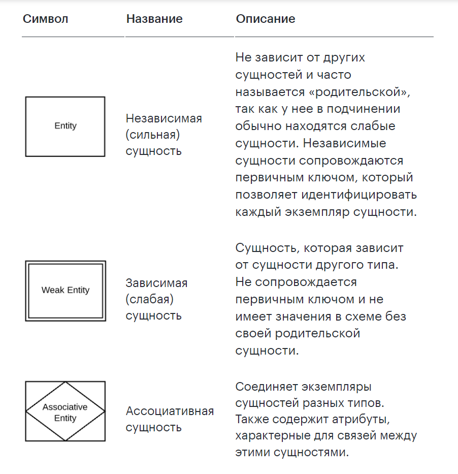
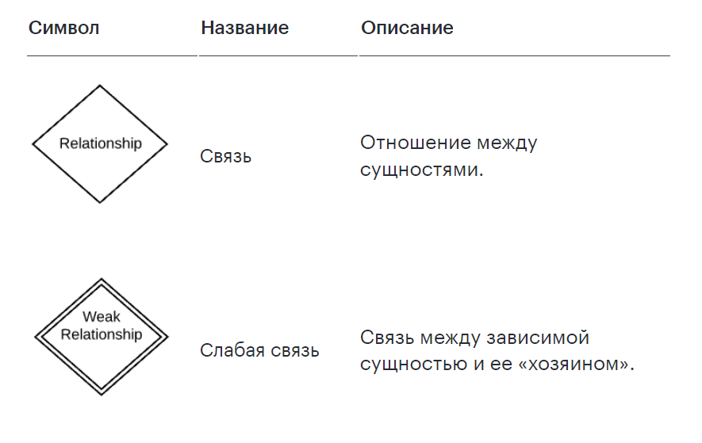
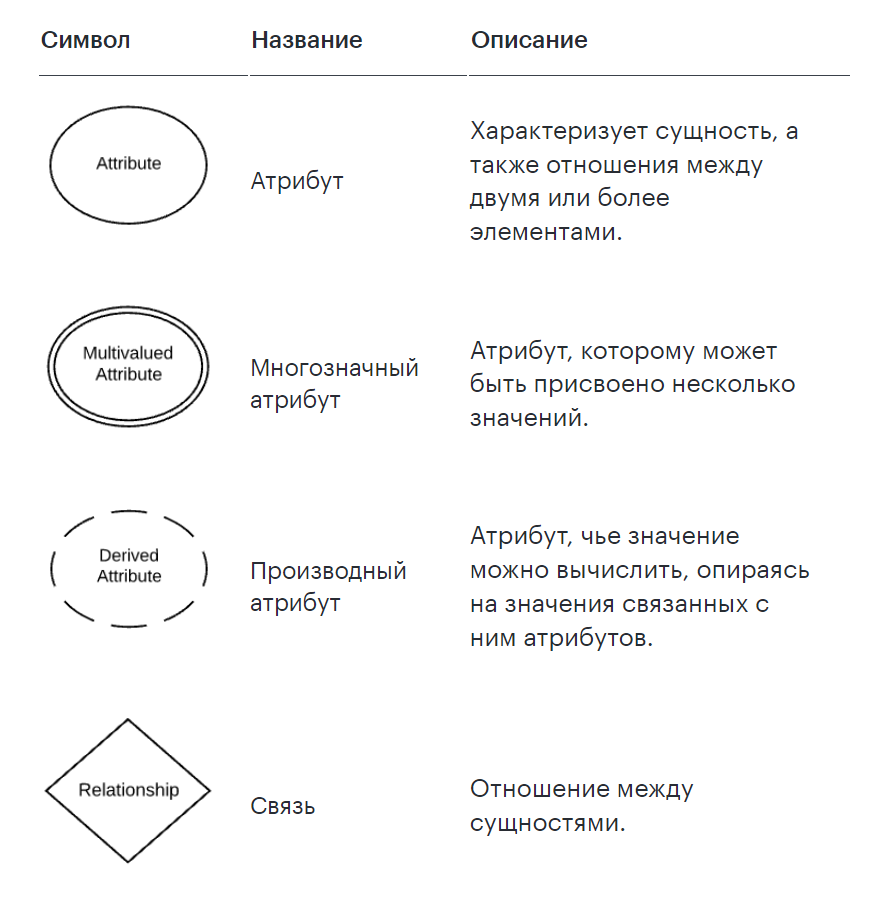
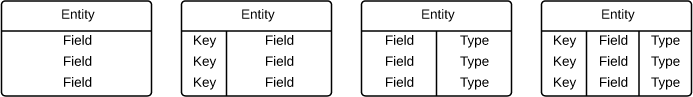
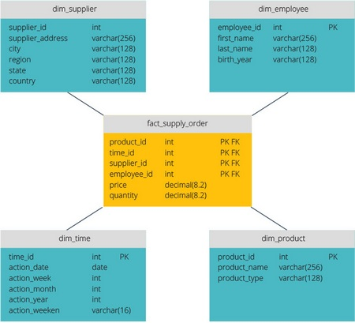
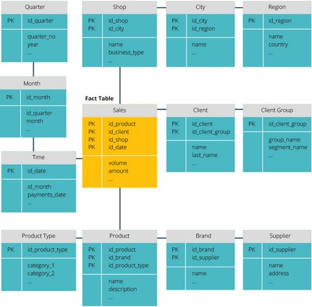
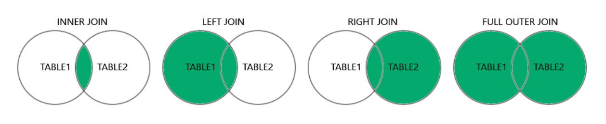
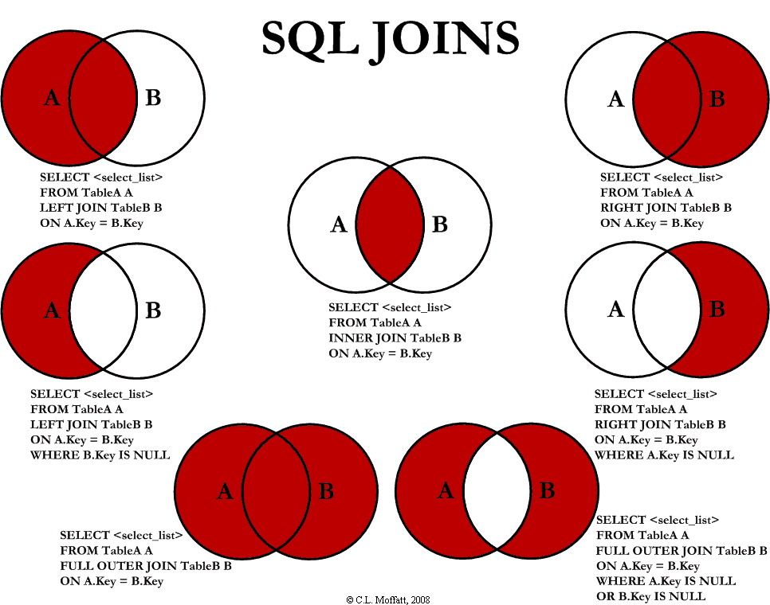
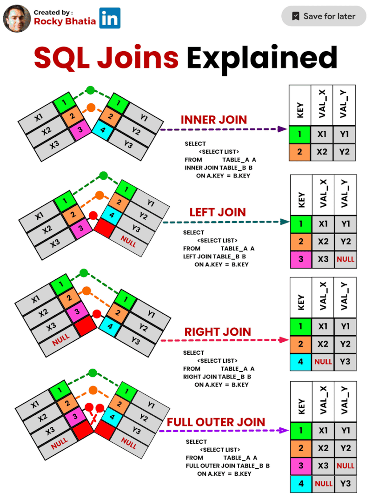

# databases-101

_Добро пожаловать в «Databases 101» — это заметки, охватывающие ключевые концепции баз данных от начального до среднего уровня. Материалы подойдут как новичкам, стремящимся получить прочную базу, так и более опытным пользователям, желающим освежить свои знания. Заметки охватывают такие темы, как SQL-запросы, оптимизация и производительность, транзакции и согласованность данных, и многое другое. Некоторые темы сгруппированы логически для лучшего понимания, а план, представленный ниже, поможет легко ориентироваться в представленных материалах._

## План

### [Введение в базы данных 🗃️](#введение-в-базы-данных)

- [Базы данных и СУБД](#базы-данных-и-субд) // TBD
- [ETL-процессы](#etl-процессы) // TBD
- [ER-диаграмма](#er-диаграмма)
- [Ключи](#ключи) // TBD
- [Нормализация и денормализация форм](#нормализация-и-денормализация-форм) // TBD
- [Схемы "звезда" и "снежинка"](#схемы-звезда-и-снежинка)

### [Основы SQL 🧮](#основы-sql)

- [SQL](#sql)
- [SELECT](#select)
- [Агрегатные функции](#агрегатные-функции)
- [WHERE и HAVING](#where-и-having)
- [ORDER BY](#order-by)
- [CASE](#case)
- [Объединения таблиц](#объединения-таблиц)
- [Вложенные запросы](#вложенные-запросы)

### [Расширенные возможности SQL 🚀](#расширенные-возможности-sql)

- [Функции](#функции)
- [Аналитические функции](#аналитические-функции)
- [Представления](#представления) // TBD
- [Хранимые процедуры](#хранимые-процедуры) // TBD
- [Триггеры](#триггеры) // TBD

### [Оптимизация и производительность 🔋](#оптимизация-и-производительность)

- [EXPLAIN](#explain)
- [Индексы](#индексы)
- [Масштабирование](#масштабирование)
- [Партицирование](#партицирование)
- [Шардинг](#шардинг)
- [Репликация](#репликация)
- [Кэширования](#механизмы-кэширования) // TBD

### [Транзакции и согласованность данных ⏳](#транзакции-и-согласованность-данных)

- [Транзакции](#транзакции)
- [ACID](#acid)
- [Уровни изоляции транзакций](#уровни-изоляции-транзакций)
- [Аномалии](#аномалии)
- [Блокировки](#блокировки)
- [MVCC](#mvcc)
- [SELECT FOR UPDATE и SELECT FOR SHARE](#select-for-update-и-select-for-share)

### [Безопасность 🔐](#безопасность)

- [Управление доступом](#управление-доступом) // TBD
- [Шифрование данных](#шифрование-данных) // TBD
- [Аудит и журналирование](#аудит-и-журналирование) // TBD

### [Дополнительная информация 🗂️](#дополнительная-информация)

- [Архитектура](#архитектура) // TBD
- [Теорема CAP](#теорема-cap)

### [SQL на практике 🙌🏻](#sql-на-практике)

- [Справочники](#справочники)
- [Практические задания](#практические-задания)

## Введение в базы данных

### ER-диаграмма

<details>
<summary>Подробнее</summary>

**Что такое ER-диаграмма?**

**Схема «сущность-связь»** (также **ERD** или **ER-диаграмма**) — это разновидность блок-схемы, где показано, как разные «сущности» (люди, объекты, концепции и так далее) связаны между собой внутри системы. ER-диаграммы чаще всего применяются для проектирования и отладки реляционных баз данных в сфере образования, исследования и разработки программного обеспечения и информационных систем для бизнеса. ER-диаграммы (или ER-модели) полагаются на стандартный набор символов, включая прямоугольники, ромбы, овалы и соединительные линии, для отображения сущностей, их атрибутов и связей. Эти диаграммы устроены по тому же принципу, что и грамматические структуры: сущности выполняют роль существительных, а связи — глаголов.

<div align="center">
  
</div>

ER-диаграммы — «родственники» схем структуры данных (DSD), где вместо связей между самими сущностями отображаются отношения между элементами внутри них.

ER-диаграммы часто используются в сочетании с диаграммами DFD, которые схематично показывают движение потоков информации в рамках процесса или системы.

<div align="center">
  
</div>

В ER-моделях и моделях данных обычно выделяют до **трех уровней детализации**:

- **Концептуальная** модель данных — схема наивысшего уровня с минимальным количеством подробностей. Достоинство этого подхода заключается в возможности отобразить общую структуру модели и всю архитектуру системы. Менее масштабные системы могут обойтись и без этой модели. В этом случае можно сразу переходить к логической модели.
- **Логическая** модель данных содержит более подробную информацию, нежели концептуальная модель. На этом уровне определяются более подробные операционные и транзакционные сущности. Логическая модель не зависит от технологии, в которой она будет применяться.
- **Физическая** модель данных: на основе каждой логической модели данных можно составить одну или две физических модели. В последних должно присутствовать достаточно технических подробностей для составления и внедрения самой базы данных.

Обращаем ваше внимание на тот факт, что похожие уровни масштаба и детализации встречаются и в других видах схем (например, в диаграммах DFD), однако данная классификация отличается от трехсхемного подхода в разработке ПО, где деление информации осуществляется по несколько иному принципу. Правда, иногда разработчики применяют ER-диаграммы с дополнительными иерархиями, если дизайн базы данных требует больше информационных уровней. К примеру, разработчик может добавить новые группы по принципу расширения вверх (суперклассы) и вниз (подклассы).

Только **реляционные данные**. Следует четко понимать, что цель ER-диаграмм — показать связи и отношения между элементами, поэтому они отображают только реляционную структуру.

Только для **структурированных данных**. Данные должны быть четко разбиты на поля, столбцы и строки, иначе пользы от ER-диаграммы будет мало. Это касается и частично структурированных данных, так как только некоторые из них будут пригодны для работы.

**Сложность интеграции** с существующей базой данных. Применение ER-моделей для интеграции с существующей базой данных — непростая задача по причине различия в архитектурах.

**Символы и способы нотации ERD**

Концептуальные модели данных дают общее представление о том, что должно входить в состав модели. Концептуальные ER-диаграммы можно брать за основу логических моделей данных. Их также можно использовать для создания отношений общности между разными ER-моделями, положив их в основу интеграции. Все приведенные ниже символы можно найти в библиотеках «Сущность-связь» для UML» и «Фигуры по модели «сущность-связь» на Lucidchart.

- **Символы ERD-сущностей**

Под понятием «сущности» подразумеваются объекты или понятия, несущие важную информацию. С точки зрения грамматики, они, как правило, обозначаются существительными, например, «товар», «клиент», «заведение» или «промоакция». Ниже представлены три наиболее распространенных типа сущностей, используемых в ER-диаграммах.

<div align="center">
  
</div>

- **Символы ERD-связей**

Связи используются в схемах «сущность-связь» для обозначения взаимодействия между двумя сущностями. Грамматически связи, как правило, выражаются глаголами, например, «назначить», «закрепить», «отследить», и несут полезную информацию, которую невозможно получить, опираясь только на типы сущностей.

<div align="center">
  
</div>

- **Символы ERD-атрибутов**

ERD-атрибуты характеризуют сущности, позволяя пользователям лучше разобраться в устройстве базы данных. Атрибуты содержат информацию о сущностях, выделенных в концептуальной ER-диаграмме.

<div align="center">
  
</div>

- **Символы физических ER-диаграмм**

Физическая модель данных — самый детальный уровень ER-схем, где представлен процесс добавления информации в базу данных. Физические модели «сущность-связь» отображают всю структуру таблицы, включая названия столбцов, типы данных, ограничения столбцов, первичные и внешние ключи, а также отношения между таблицами.

**Ключевые составляющие таблиц «сущность-связь»:**

- **Поля**

Поля — это участки таблицы, где задаются атрибуты сущностей. Под атрибутами обычно подразумеваются столбцы базы данных, которая моделируется по принципу «сущность-связь».

<div align="center">
  
</div>

- **Ключи**

Ключи — один из способов категоризации атрибутов. Напоминаем, что ER-диаграммы помогают пользователям моделировать базы данных посредством таблиц, которые обеспечивают им упорядоченность, эффективность и высокую скорость работы. Ну а ключи применяются с целью максимально эффективно связать между собой разные таблицы в базе данных.

- **Первичные ключи**

Первичный ключ — это атрибут или сочетание атрибутов, идентифицирующих один конкретный экземпляр сущности.

- **Внешние ключи**

Внешний ключ создается каждый раз, когда атрибут привязывается к сущности посредством единичной или множественной связи.

<div align="center">
  
</div>

К примеру, займ на каждый отдельный автомобиль может быть выдан только одним банком, поэтому в качестве внешнего ключа FinancedBy («кем выдан займ») в таблице Car (автомобиль») использован основной ключ BankId («идентификатор банка»).При этом идентификатор BankId может служить внешним ключом сразу для нескольких автомобилей.

- **Типы**

Под типом подразумевается тип данных в соответствующем поле таблицы. Однако это также может быть и тип сущности, то есть описание ее составляющих. Например, у сущности «книга» будут следующие типы: «автор», «название» и «дата публикации».

<div align="center">
  
</div>

**Нотация ER-диаграмм**

Хотя нотация Crow's Foot («вороньи лапки») часто признается наиболее интуитивной, некоторые пользователи отдают предпочтение нотации Бахмана, OMT, IDEF или UML. Тем не менее, «вороньи лапки» действительно предлагают наглядный интуитивный формат — вот почему мы выбрали их для нотации ER-диаграмм в Lucidchart.

**Кардинальность и ординальность**

Под кардинальностью подразумевается максимальное число связей, которое может быть установлено между экземплярами разных сущностей. Ординальность, в свою очередь, указывает минимальное количество связей между экземплярами двух сущностей.

Кардинальность и ординальность отображаются на соединительных линиях согласно выбранному формату нотации.

<div align="center">
  
</div>

_Больше о том, как создать ER-диаграмму можно найти здесь: [Что такое ER-диаграмма и как ее создать?](https://www.lucidchart.com/pages/ru/erd-%D0%B4%D0%B8%D0%B0%D0%B3%D1%80%D0%B0%D0%BC%D0%BC%D0%B0)_

</details>

### Схемы "звезда" и "снежинка"

<details>
<summary>Подробнее</summary>

Важным решением при настройке хранилища данных является выбор между схемой «звезда» и схемой «снежинка».

Звездообразная схема упрощает структуру базы данных за счет прямого подключения таблиц измерений к центральной таблице фактов. Звездообразный дизайн упрощает поиск и анализ данных за счет консолидации связанных точек данных, тем самым повышая эффективность и ясность запросов к базе данных. И наоборот, схема «снежинка» использует более детальный подход, разбивая таблицы измерений. в дополнительные таблицы, что приводит к более сложным отношениям, где каждая ветвь представляет отдельный аспект данных.

**Что такое звездообразная схема (Star Schema)?**

<div align="center">
  
</div>

**Схема звезды** — это тип схемы хранилища данных, который состоит из одной или нескольких таблиц фактов, ссылающихся на несколько таблиц измерений. Эта схема вращается вокруг центральной таблицы, называемой «таблицей фактов». Он окружен несколькими напрямую связанными таблицами, называемыми «таблицами измерений». Кроме того, существуют внешние ключи, которые связывают данные из одной таблицы в другую, устанавливая связь между ними с помощью первичного ключа другой таблицы. Этот процесс служит средством перекрестных ссылок, обеспечивая связность и согласованность в структуре базы данных.

Таблица фактов содержит количественные данные, часто называемые мерами или метриками. Меры, как правило, числовые, такие как скорость, стоимость, количество и вес, и их можно агрегировать. Таблица фактов содержит ссылки на внешние ключи на таблицы измерений, которые содержат нечисловые элементы. Это описательные атрибуты, такие как сведения о продукте (название, категория, бренд), информация о клиенте (имя, адрес, сегмент), показатели времени (дата, месяц, год) и т. д. Каждая таблица измерений представляет определенный аспект или измерение данных. Измерение обычно имеет столбец первичного ключа, и на него ссылается таблица фактов через отношения внешнего ключа.

**В звездной схеме:**

- Таблица фактов, содержащая основные метрики, расположена в центре.
- Каждая таблица измерений напрямую связана с таблицей фактов, но не с другими таблицами измерений, поэтому имеет звездчатую структуру.
  Простота схемы «звезда» облегчает составление агрегированных отчетов и анализ, а также оптимизирует операции по извлечению данных. Это связано с тем, что запросы обычно включают меньше соединений по сравнению с более нормализованными схемами. Уменьшенная сложность и простая структура оптимизируют доступ к данным и их обработку, что хорошо подходит для облачных решений для хранения данных.

Более того, четкое разграничение между измерениями и фактами позволяет пользователям легко анализировать информацию по различным измерениям. Это делает звездообразную схему также основополагающей моделью в приложениях бизнес-аналитики.

**Характеристики звездообразной схемы:**

- **Центральная таблица фактов**: В центре находится таблица основных фактов, содержащая показатели. Он представляет деятельность, события и бизнес-операции.
- **Таблицы размеров**: Они окружают таблицу фактов и представляют конкретный аспект бизнес-контекста. В таблицах измерений показаны описательные атрибуты.
- **Отношения первичный-внешний ключ**: Связь между таблицей фактов и таблицей измерений устанавливается через отношения первичный-внешний ключ, позволяя агрегировать данные по разным измерениям.
- **Связь с размерными таблицами**: Между таблицами измерений нет никаких связей. Все таблицы измерений подключены только к центральной таблице фактов.
- **Денормализованная структура**: таблицы измерений часто денормализованы, что полезно для уменьшения необходимости в соединениях во время запросов, поскольку необходимые атрибуты включаются в одно измерение, а не разбивают их на несколько таблиц.
- **Оптимизированная производительность запросов**: Такие функции, как прямые связи между таблицами фактов и измерений и денормализованная структура, способствуют оптимизации производительности запросов. Это позволяет звездообразным схемам решать сложные аналитические задачи и, таким образом, хорошо подходит для анализа данных и составления отчетов.

Звездообразные схемы идеально подходят для приложений, включающих многомерный анализ данных, таких как OLAP (онлайн-аналитическая обработка). Инструменты OLAP эффективно поддерживают структуру звездообразной схемы для выполнения свертывания, детализации, агрегирования и других аналитических операций в различных измерениях.

**Что такое схема снежинки (Snowflake Schema)?**

<div align="center">
  
</div>

A **схема снежинки** является расширением модели звездообразной схемы, в которой таблицы измерений нормализуются в несколько связанных таблиц, напоминающих форму снежинки.

В схеме «снежинка» есть центральная таблица фактов, содержащая количественные показатели. Эта таблица фактов напрямую связана с таблицы размеров. Эти таблицы измерений нормализуются в подизмерения, содержащие определенные атрибуты внутри измерения. В сравнении По сравнению со схемой «звезда», схема «снежинка» уменьшает избыточность данных и улучшает целостность данных, но вносит дополнительную сложность в запросы из-за необходимости большего количества соединений. Эта сложность часто влияет на производительность и понятность модели измерений.

**Характеристики схемы «снежинка»:**

- **Нормализация**: В схеме «снежинка» таблицы измерений нормализованы, в отличие от схемы «звезда», где таблицы денормализованы. Это означает, что атрибуты в таблицах измерений разбиваются на несколько связанных таблиц.
- **Иерархическая структура**: Нормализация таблиц измерений создает иерархическую структуру, напоминающую снежинку.
- **Связь между таблицами**: Нормализация приводит к дополнительным связям соединения между нормализованными таблицами, что увеличивает сложность запросов.
- **Производительность**: Объединение нескольких нормализованных таблиц в схему «снежинка» требует большей вычислительной мощности из-за повышенной сложности запросов, что потенциально влияет на производительность.
- **Целостность данных**: Схемы «снежинка» уменьшают избыточность и устраняют аномалии обновления. Это гарантирует, что данные будут храниться согласованным и нормализованным образом.
- **Гибкост**ь: Схемы «снежинка» обеспечивают гибкость в организации и управлении сложными связями данных, что обеспечивает более структурированный подход к анализу данных.

**Ключевые различия между схемой «Звезда» и «Снежинка»**

<div align="center">
  
</div>

1. Архитектура
   Таблицы измерений денормализованы в звездообразной схеме. Это означает, что они представлены в виде отдельных таблиц, в которых содержатся все атрибуты. Структура этой схемы напоминает звезду, демонстрируя таблицу фактов в центре и исходящие от нее таблицы измерений. С другой стороны, схема «снежинка» имеет нормализованные таблицы измерений. Это означает, что они разбиты на несколько связанных таблиц. Такая нормализация создает иерархическую структуру, напоминающую снежинку, с дополнительными уровнями таблиц, ответвляющимися от основных таблиц измерений.

2. Нормализация
   Звездообразные схемы денормализованы, где все атрибуты находятся в одной таблице для каждого измерения. Эта денормализация сделана намеренно для повышения производительности. Однако его недостатком является то, что может возникнуть избыточность данных, т. е. одни и те же данные появляются в нескольких таблицах измерений, что требует большего объема памяти. Схема «снежинка» представляет собой нормализованную таблицу измерений с атрибутами, разбитыми на несколько связанных таблиц. Схема «снежинка» позволяет избежать избыточности данных, повышает качество данных и использует меньше места для хранения, чем схема «звезда».

3. Производительность запросов
   Учитывая меньшее количество операций соединения и более простую структуру таблицы в схеме «звезда», производительность запросов обычно выше по сравнению со схемой «снежинка». С другой стороны, схема «снежинка» содержит сложные операции соединения, которые требуют доступа к данным из нескольких нормализованных таблиц. В результате схема «снежинка» обычно приводит к снижению производительности запросов.

4. Техническое обслуживание
   В зависимости от нескольких факторов, таких как сложность данных, обновления и объем памяти, поддержка схем «звезда» и «снежинка» может оказаться сложной задачей. Однако схемы «звезда» обычно легче поддерживать по сравнению со схемами «снежинка» из-за меньшего количества операций соединения, которые упрощают оптимизацию запросов. Однако денормализованная структура способствует некоторому уровню избыточности, что требует тщательного управления для повышения точности анализа данных и понимания. Процесс нормализации в схемах-снежинках увеличивает сложность и затрудняет поддержку. Соединения требуют дополнительного внимания для поддержания приемлемого уровня производительности. Более того, управление обновлениями и вставками в схеме «снежинка» более сложное, поскольку необходимо распространять изменения по нескольким связанным таблицам. Это можно сравнить со звездообразной схемой, где данные сконцентрированы в меньшем количестве таблиц. Обновления обычно затрагивают только одну или несколько таблиц, что упрощает управление ими.

| Схема «Звезда»                                                                           | Схема «Снежинка»                                                                                          |
| ---------------------------------------------------------------------------------------- | --------------------------------------------------------------------------------------------------------- |
| Иерархии размеров хранятся в таблице размеров.                                           | Иерархии разделены на отдельные таблицы.                                                                  |
| Содержит таблицу фактов, окруженную таблицами измерений.                                 | Одна таблица фактов, окруженная таблицей измерений, которая, в свою очередь, окружена таблицей измерений. |
| Только одно соединение создает связь между таблицей фактов и любыми таблицами измерений. | Требует множества соединений для получения данных.                                                        |
| Простой дизайн БД.                                                                       | Очень сложная конструкция БД.                                                                             |
| Денормализованная структура данных, запросы выполняются быстрее.                         | Нормализованная структура данных.                                                                         |
| Высокий уровень избыточности данных.                                                     | Очень низкий уровень избыточности данных.                                                                 |
| Таблица одного измерения содержит агрегированные данные.                                 | Данные разделены на разные таблицы измерений.                                                             |
| Обработка куба происходит быстрее.                                                       | Обработка куба может быть медленной из-за сложного соединения.                                            |
| Таблицы могут быть связаны с несколькими измерениями.                                    | Представлена ​​централизованной таблицей фактов, которая вряд ли связана с несколькими измерениями.       |
| Предлагает более эффективные запросы с использованием оптимизации запросов Star Join.    |                                                                                                           |

</details>

## Основы SQL

### SQL

<details>
<summary>Подробнее</summary>

**SQL** — язык структурированных запросов (SQL, Structured Query Language), который используется в качестве эффективного способа сохранения данных, поиска их частей, обновления, извлечения и удаления из базы данных.

Обращение к реляционным СУБД осуществляется именно благодаря SQL. С помощью него выполняются все основные манипуляции с базами данных, например:

- Извлекать данные из базы данных
- Вставлять записи в базу данных
- Обновлять записи в базе данных
- Удалять записи из базы данных
- Создавать новые базы данных
- Создавать новые таблицы в базе данных
- Создавать хранимые процедуры в базе данных
- Создавать представления в базе данных
- Устанавливать разрешения для таблиц, процедур и представлений

**Диалекты SQL (расширения SQL)**

Язык SQL – универсальный язык для всех реляционных систем управления базами данных, но многие СУБД вносят свои изменения в язык, применяемый в них, тем самым отступая от стандарта. Такие языки называют диалектами или расширениями языка.

Вот некоторые из них:

- **T-SQL** – диалект Microsoft SQL Server
- **PL/SQL** – диалект Oracle Database
- **PL/pgSQL** – диалект PostgreSQL

С точки зрения реализации язык SQL представляет собой набор операторов, которые делятся на определенные группы и у каждой группы есть свое назначение. В сокращенном виде эти группы называются **DDL**, **DML**, **DCL** и **TCL**.

**Группы операторов языка SQL**

**DDL – Data Definition Language**

– это группа операторов определения данных. Другими словами, с помощью операторов, входящих в эту группы, мы определяем структуру базы данных и работаем с объектами этой базы, т.е. создаем, изменяем и удаляем их.

В эту группу входят следующие операторы:

- `CREATE` – используется для создания объектов базы данных;
- `ALTER` – используется для изменения объектов базы данных;
- `DROP` – используется для удаления объектов базы данных.

**DML – Data Manipulation Language**

– это группа операторов для манипуляции данными. С помощью этих операторов мы можем добавлять, изменять, удалять и выгружать данные из базы, т.е. манипулировать ими.

В эту группу входят самые распространённые операторы языка SQL:

- `SELECT` – осуществляет выборку данных;
- `INSERT` – добавляет новые данные;
- `UPDATE` – изменяет существующие данные;
- `DELETE` – удаляет данные.

**DCL – Data Control Language**

– группа операторов определения доступа к данным. Иными словами, это операторы для управления разрешениями, с помощью них мы можем разрешать или запрещать выполнение определенных операций над объектами базы данных.

Сюда входят:

- `GRANT` – предоставляет пользователю или группе разрешения на определённые операции с объектом;
- `REVOKE` – отзывает выданные разрешения;
- `DENY` – задаёт запрет, имеющий приоритет над разрешением.

**TCL – Transaction Control Language**

– группа операторов для управления транзакциями. Транзакция – это команда или блок команд (инструкций), которые успешно завершаются как единое целое, при этом в базе данных все внесенные изменения фиксируются на постоянной основе или отменяются, т.е. все изменения, внесенные любой командой, входящей в транзакцию, будут отменены.

Сюда можно отнести:

- `BEGIN TRANSACTION` – служит для определения начала транзакции;
- `COMMIT TRANSACTION` – применяет транзакцию;
- `ROLLBACK TRANSACTION` – откатывает все изменения, сделанные в контексте текущей транзакции;
- `SAVE TRANSACTION` – устанавливает промежуточную точку сохранения внутри транзакции.

_Больше информации на примере MS SQL можно найти здесь: [Учебник по языку SQL (DDL, DML) на примере диалекта MS SQL Server. Часть первая](https://habr.com/ru/articles/255361/), [Учебник по языку SQL (DDL, DML) на примере диалекта MS SQL Server. Часть вторая](https://habr.com/ru/articles/255523/)_

**Общая структура запроса выглядит следующим образом:**

`SELECT` (столбцы или `*` для выбора всех столбцов; _обязательно_)

`FROM` (таблица; _обязательно_)

`WHERE` (условие/фильтрация, например, `city = Moscow`; _необязательно_)

`GROUP BY` (столбец, по которому хотим сгруппировать данные; _необязательно_)

`HAVING` (условие/фильтрация на уровне сгруппированных данных; _необязательно_)

`ORDER BY` (столбец, по которому хотим отсортировать вывод; _необязательно_)

</details>

### SELECT

<details>
<summary>Подробнее</summary>

`SELECT`, `FROM` — обязательные элементы запроса, которые определяют выбранные столбцы, их порядок и источник данных.

Выбрать все (обозначается как `*`) из таблицы `Customers`:

```sql
SELECT * FROM Customers;
```

Выбрать столбцы `CustomerID`, `CustomerName` из таблицы `Customers`:

```sql
SELECT CustomerID, CustomerName FROM Customers
```

</details>

### Агрегатные функции

<details>
<summary>Подробнее</summary>

**GROUP BY**

`GROUP BY` — необязательный элемент запроса, с помощью которого можно задать агрегацию по нужному столбцу (например, если нужно узнать какое количество клиентов живет в каждом из городов).

При использовании `GROUP BY` обязательно:

- перечень столбцов, по которым делается разрез, был одинаковым внутри `SELECT` и внутри `GROUP BY`,
- агрегатные функции (`SUM`, `AVG`, `COUNT`, `MAX`, `MIN`) должны быть также указаны внутри `SELECT` с указанием столбца, к которому такая функция применяется.

**Описание агрегатных функций**

| Функция               | Описание                         |
| --------------------- | -------------------------------- |
| `SUM`(поле_таблицы)   | Возвращает сумму значений        |
| `AVG`(поле_таблицы)   | Возвращает среднее значение      |
| `COUNT`(поле_таблицы) | Возвращает количество записей    |
| `MIN`(поле_таблицы)   | Возвращает минимальное значение  |
| `MAX`(поле_таблицы)   | Возвращает максимальное значение |

_Агрегатные функции применяются для значений, не равных `NULL`. Исключением является функция `COUNT(*)`_

Группировка количества клиентов по городу:

```sql
SELECT City, count(CustomerID) FROM Customers
GROUP BY City
```

Группировка количества клиентов по стране и городу:

```sql
SELECT Country, City, count(CustomerID) FROM Customers
GROUP BY Country, City
```

Группировка продаж по ID товара с разными агрегатными функциями: количество заказов с данным товаром и количество проданных штук товара:

```sql
SELECT ProductID, COUNT(OrderID), SUM(Quantity) FROM OrderDetails
GROUP BY ProductID
```

Группировка продаж с фильтрацией исходной таблицы. В данном случае на выходе будет таблица с количеством клиентов по городам Германии:

```sql
SELECT City, count(CustomerID) FROM Customers
WHERE Country = 'Germany'
GROUP BY City
```

Переименование столбца с агрегацией с помощью оператора `AS`. По умолчанию название столбца с агрегацией равно примененной агрегатной функции, что далее может быть не очень удобно для восприятия.

```sql
SELECT City, count(CustomerID) AS Number_of_clients FROM Customers
GROUP BY City
```

</details>

### WHERE и HAVING

<details>
<summary>Подробнее</summary>

**WHERE**

`WHERE` — необязательный элемент запроса, который используется, когда нужно отфильтровать данные по нужному условию. Очень часто внутри элемента `WHERE` используются `IN` / `NOT IN` для фильтрации столбца по нескольким значениям, `AND` / `OR` для фильтрации таблицы по нескольким столбцам.

Фильтрация по одному условию и одному значению:

```sql
SELECT * FROM Customers
WHERE City = 'London'
```

Фильтрация по одному условию и нескольким значениям с применением `IN` (включение) или `NOT IN` (исключение):

```sql
SELECT * FROM Customers
WHERE City IN ('London', 'Berlin')
```

```sql
SELECT * FROM Customers
WHERE City NOT IN ('Madrid', 'Berlin','Bern')
```

Фильтрация по нескольким условиям с применением `AND` (выполняются все условия) или `OR` (выполняется хотя бы одно условие) и нескольким значениям:

```sql
SELECT * FROM Customers
WHERE Country = 'Germany' AND City NOT IN ('Berlin', 'Aachen') AND CustomerID > 15
```

```sql
SELECT * FROM Customers
WHERE City IN ('London', 'Berlin') OR CustomerID > 4
```

**HAVING**

`HAVING` — необязательный элемент запроса, который отвечает за фильтрацию на уровне сгруппированных данных (по сути, `WHERE`, но только после группировки результатов - на уровень выше).

Фильтрация агрегированной таблицы с количеством клиентов по городам, в данном случае оставляем в выгрузке только те города, в которых не менее 5 клиентов:

```sql
SELECT City, count(CustomerID) FROM Customers
GROUP BY City
HAVING count(CustomerID) >= 5
```

В случае с переименованным столбцом внутри `HAVING` можно указать как и саму агрегирующую конструкцию `count(CustomerID)`, так и новое название столбца `number_of_clients`:

```sql
SELECT City, count(CustomerID) AS number_of_clients FROM Customers
GROUP BY City
HAVING number_of_clients >= 5
```

Пример запроса, содержащего `WHERE` и `HAVING`. В данном запросе сначала фильтруется исходная таблица по пользователям, рассчитывается количество клиентов по городам и остаются только те города, где количество клиентов не менее 5:

```sql
SELECT City, count(CustomerID) AS number_of_clients FROM Customers
WHERE CustomerName NOT IN ('Around the Horn','Drachenblut Delikatessend')
GROUP BY City
HAVING number_of_clients >= 5
```

</details>

### ORDER BY

<details>
<summary>Подробнее</summary>

**ORDER BY**

`ORDER BY` — необязательный элемент запроса, который отвечает за сортировку таблицы.

Простой пример сортировки по одному столбцу. В данном запросе осуществляется сортировка по городу, который указал клиент:

```sql
SELECT * FROM Customers
ORDER BY City
```

Осуществлять сортировку можно и по нескольким столбцам, в этом случае сортировка происходит по порядку указанных столбцов:

```sql
SELECT * FROM Customers
ORDER BY Country, City
```

По умолчанию сортировка происходит по возрастанию для чисел и в алфавитном порядке для текстовых значений. Если нужна обратная сортировка, то в конструкции `ORDER BY` после названия столбца надо добавить `DESC`:

```sql
SELECT * FROM Customers
ORDER BY CustomerID DESC
```

Обратная сортировка по одному столбцу и сортировка по умолчанию по второму:

```sql
SELECT * FROM Customers
ORDER BY Country DESC, City
```

</details>

### CASE

<details>
<summary>Подробнее</summary>

`CASE` выражение в SQL используется для выполнения условной логики в запросах. Оно позволяет проверять условия и возвращать значение, как только первое условие выполнено. Поэтому как только встречается правдивое условие, чтение останавливается, и возвращается результат.

Существует две формы выражения `CASE`: **простое (simple) CASE** и **поиск с условиями (searched) CASE**.

1. Простое выражение `CASE`
   В этой форме SQL сравнивает выражение с набором возможных значений и возвращает результат первого совпадения.

Синтаксис:

```sql
CASE
    WHEN condition1 THEN result1
    WHEN condition2 THEN result2
    ...
    ELSE default_result
END
```

Пример:

```sql
SELECT
    product_name,
    CASE category_id
        WHEN 1 THEN 'Electronics'
        WHEN 2 THEN 'Books'
        ELSE 'Other'
    END AS category
FROM products;
```

Здесь, в зависимости от category_id, продукту присваивается соответствующая категория.
Если нет совпадений, выполняется условие ELSE, возвращающее 'Other'.

2. Поиск с условиями CASE
   Эта форма позволяет использовать логические условия (например, >, <, =, !=), а не просто сопоставлять выражение с конкретными значениями.

Синтаксис:

```sql
CASE
    WHEN condition1 THEN result1
    WHEN condition2 THEN result2
    ...
    ELSE default_result
END
```

Пример:

```sql
SELECT
    employee_name,
    salary,
    CASE
        WHEN salary > 80000 THEN 'High'
        WHEN salary BETWEEN 50000 AND 80000 THEN 'Medium'
        ELSE 'Low'
    END AS salary_range
FROM employees;
```

Это выражение `CASE` проверяет различные условия для зарплаты и возвращает соответствующий диапазон зарплаты.

**Основные моменты:**

- Условия в блоках `WHEN` проверяются по порядку, и первое, которое возвращает `TRUE`, используется.
- Блок `ELSE` необязателен и задаёт значение по умолчанию, если ни одно условие не выполнено.
- `CASE` часто используется в операторе `SELECT`, но также может применяться в `UPDATE`, `DELETE` и других частях запроса.

</details>

### Объединения таблиц

<details>
<summary>Подробнее</summary>

Объединения таблиц основаны на принципе первичных и вторичных ключей таблиц и являются одной из основ работы реляционных СУБД.

`INNER JOIN`

Cоединение, при котором находятся пары записей из двух таблиц, удовлетворяющие условию соединения, тем самым образуя новую таблицу, содержащую поля из первой и второй исходных таблиц.

`LEFT JOIN`

Соединение, которое возвращает все значения из левой таблицы, соединённые с соответствующими значениями из правой таблицы, если они удовлетворяют условию соединения, или заменяет их на NULL в обратном случае.

`RIGHT JOIN`

Соединение, которое возвращает все значения из правой таблицы, соединённые с соответствующими значениями из левой таблицы, если они удовлетворяют условию соединения, или заменяет их на NULL в обратном случае.

`FULL JOIN`

Соединение, которое выполняет внутреннее соединение записей и дополняет их левым внешним соединением и правым внешним соединением.

**Алгоритм работы полного соединения:**

- Формируется таблица на основе внутреннего соединения (INNER JOIN)
- В таблицу добавляются значения не вошедшие в результат формирования из левой таблицы (LEFT OUTER JOIN)
- В таблицу добавляются значения не вошедшие в результат формирования из правой таблицы (RIGHT OUTER JOIN)

[Базовые запросы для разных вариантов объединения таблиц](https://sql-academy.org/ru/guide/outer-join#bazovye-zaprosy-dlya-raznyh-variantov-obuedineniya-tablic)

<div align="center">
  
  
  
</div>

</details>

### Вложенные запросы

<details>
<summary>Подробнее</summary>

**Вложенный запрос** – это запрос, который находится внутри другого SQL запроса и встроен внутри условного оператора `WHERE`.

Данный вид запросов используется для возвращения данных, которые будут использоваться в основном запросе, как условие для ограничения получаемых данных.

**Правила вложенных запросов**

На вложенный запрос распространяются следующие ограничения:

- Список выбора вложенного запроса, начинающийся с оператора сравнения, может включать только одно выражение или имя столбца (за исключением операторов `EXISTS` и `IN` в инструкции `SELECT *` или в списке соответственно).
- Если предложение `WHERE` внешнего запроса включает имя столбца, оно должно быть совместимо для соединения со столбцом в списке выбора вложенного запроса.
- Типы данных `ntext`, текста и изображения нельзя использовать в списке вложенных запросов.
- Так как они должны возвращать одно значение, вложенные запросы, представленные оператором немодифицированного сравнения (один не следует ключевому слову `ANY` или `ALL`) не могут включать `GROUP BY` и `HAVING` предложения.
- Ключевое `DISTINCT` слово нельзя использовать с вложенными запросами, включающими `GROUP BY`.
- Не `COMPUTE` удается указать предложения и `INTO` предложения.
- Предложение `ORDER BY` может быть указано только вместе с предложением `TOP`.
- Представление, созданное с помощью вложенных запросов, не может быть обновлено.
- Список выбора вложенного запроса, начинающегося с предложения `EXISTS`, по соглашению содержит звездочку `*` вместо отдельного имени столбца. Правила для вложенного запроса, начинающегося с предложения `EXISTS`, являются такими же, как для стандартного списка выбора, поскольку вложенный запрос, начинающийся с предложения `EXISTS`, проводит проверку на существование и возвращает `TRUE` или `FALSE` вместо данных.

_Больше информации с примерами можно найти здесь: [Вложенные запросы (SQL Server)](https://learn.microsoft.com/ru-ru/sql/relational-databases/performance/subqueries?view=sql-server-ver16)_

</details>

## Расширенные возможности SQL

### Функции

<details>
<summary>Подробнее</summary>

**Применение функций**

При составлении SQL запросов мы можем использовать встроенные функции, которые выполняют различные операции над данными и возвращают результат. Их можно использовать для обработки строк, чисел, дат, а также выполнения агрегатных операций, как в одном значении, так и на наборе строк.

Функции в SQL можно разделить на несколько категорий:

**Агрегатные функции**

Эти функции работают с множеством строк и возвращают одно агрегированное значение. Их часто используют вместе с операцией `GROUP BY`.

- **COUNT()**: Возвращает количество строк.

  ```sql
  SELECT COUNT(*) FROM users;
  ```

- **SUM()**: Возвращает сумму значений.

  ```sql
  SELECT SUM(salary) FROM employees;
  ```

- **AVG()**: Возвращает среднее значение.

  ```sql
  SELECT AVG(age) FROM users;
  ```

- **MIN()**: Возвращает минимальное значение.

  ```sql
  SELECT MIN(salary) FROM employees;
  ```

- **MAX()**: Возвращает максимальное значение.
  ```sql
  SELECT MAX(salary) FROM employees;
  ```

**Строковые функции**

Эти функции работают с текстовыми данными, позволяя изменять строки, находить подстроки и выполнять другие операции с текстом.

- **LENGTH()**: Возвращает длину строки.

  ```sql
  SELECT LENGTH('Hello World');
  ```

- **LOWER()** / **UPPER()**: Преобразуют строку к нижнему или верхнему регистру.

  ```sql
  SELECT LOWER('HELLO'), UPPER('hello');
  ```

- **SUBSTRING()**: Возвращает подстроку.

  ```sql
  SELECT SUBSTRING('Hello World', 1, 5);  -- Вернет 'Hello'
  ```

- **CONCAT()**: Объединяет строки.

  ```sql
  SELECT CONCAT(first_name, ' ', last_name) FROM users;
  ```

- **TRIM()**: Удаляет пробелы в начале и конце строки.
  ```sql
  SELECT TRIM('   Hello World   ');
  ```

**Числовые функции**

Работают с числовыми данными для выполнения математических операций.

- **ROUND()**: Округляет число до указанного количества знаков после запятой.

  ```sql
  SELECT ROUND(123.456, 2);  -- Вернет 123.46
  ```

- **CEIL()** / **FLOOR()**: Округляют число вверх или вниз до ближайшего целого.

  ```sql
  SELECT CEIL(1.2), FLOOR(1.8);  -- Вернет 2 и 1 соответственно
  ```

- **ABS()**: Возвращает абсолютное значение числа.

  ```sql
  SELECT ABS(-10);  -- Вернет 10
  ```

- **MOD()**: Возвращает остаток от деления.
  ```sql
  SELECT MOD(10, 3);  -- Вернет 1
  ```

**Дата и время функции**

Эти функции работают с датами и временем, позволяя извлекать части даты, добавлять или вычитать дни, месяцы и т.д.

- **NOW()**: Возвращает текущую дату и время.

  ```sql
  SELECT NOW();
  ```

- **CURDATE()**: Возвращает текущую дату.

  ```sql
  SELECT CURDATE();
  ```

- **DATE_ADD()**: Добавляет к дате указанный интервал.

  ```sql
  SELECT DATE_ADD('2024-01-01', INTERVAL 7 DAY);  -- Вернет '2024-01-08'
  ```

- **DATEDIFF()**: Возвращает разницу между двумя датами в днях.

  ```sql
  SELECT DATEDIFF('2024-12-31', '2024-01-01');  -- Вернет 364
  ```

- **YEAR()**, **MONTH()**, **DAY()**: Извлекают соответствующую часть даты.
  ```sql
  SELECT YEAR(NOW()), MONTH(NOW()), DAY(NOW());
  ```

**Логические функции**

Эти функции применяются для работы с булевыми значениями и выражениями.

- **IF()**: Возвращает одно значение, если условие истинно, и другое — если ложно.

  ```sql
  SELECT IF(salary > 5000, 'High', 'Low') FROM employees;
  ```

- **COALESCE()**: Возвращает первое ненулевое (не `NULL`) значение.

  ```sql
  SELECT COALESCE(NULL, NULL, 'Value');  -- Вернет 'Value'
  ```

- **NULLIF()**: Возвращает `NULL`, если два выражения равны, иначе возвращает первое выражение.
  ```sql
  SELECT NULLIF(10, 10);  -- Вернет NULL
  ```

Пример использования функций:

```sql
SELECT CONCAT(first_name, ' ', last_name) AS full_name,
       YEAR(NOW()) - YEAR(birthdate) AS age,
       IF(salary > 5000, 'High Salary', 'Low Salary') AS salary_status
FROM employees;
```

Этот запрос возвращает полное имя сотрудника, возраст и статус зарплаты на основе условия.

Функции в SQL позволяют эффективно работать с данными, улучшая обработку запросов и предоставляя различные способы манипуляции числами, строками и датами.

_[Справочник по функциям SQL](https://sql-academy.org/ru/handbook)_

</details>

### Аналитические функции

<details>
<summary>Подробнее</summary>

**Аналитические функции** в SQL (также известные как **оконные функции**) позволяют выполнять вычисления по набору строк, подобно агрегатным функциям, но с тем отличием, что они не группируют строки в одну запись, а возвращают результат для каждой строки. Эти функции полезны, когда нужно анализировать данные, сохраняя доступ к каждой строке исходного набора данных.

**Синтаксис аналитических функций**

Обычно аналитические функции пишутся следующим образом:

```sql
<функция>([аргументы]) OVER ([PARTITION BY] [ORDER BY])
```

- **Функция** — это аналитическая функция, например, `ROW_NUMBER()`, `RANK()`, `SUM()`, `AVG()` и другие.
- **OVER** — ключевое слово, которое указывает на использование оконной функции.
- **PARTITION BY** — позволяет разделить набор данных на группы, в пределах которых будет происходить расчет функции (аналогично `GROUP BY`).
- **ORDER BY** — определяет порядок, в котором строки должны быть упорядочены для расчетов.

**Часто используемые аналитические функции**

- `ROW_NUMBER()`: возвращает номер строки в пределах каждой группы в указанном порядке.

  ```sql
  SELECT ROW_NUMBER() OVER (ORDER BY salary DESC) AS row_num, employee_name, salary
  FROM employees;
  ```

- `RANK()`: присваивает уникальные номера каждой строке на основе указанного порядка, при этом строки с одинаковыми значениями получают одинаковый ранг.

  ```sql
  SELECT RANK() OVER (ORDER BY salary DESC) AS rank, employee_name, salary
  FROM employees;
  ```

- `DENSE_RANK()`: отличается от `RANK()`, так как при одинаковых значениях строки пропуски между рангами не образуются.

  ```sql
  SELECT DENSE_RANK() OVER (ORDER BY salary DESC) AS dense_rank, employee_name, salary
  FROM employees;
  ```

- `NTILE(n)`: делит строки на _n_ равных частей (кусков).

  ```sql
  SELECT NTILE(4) OVER (ORDER BY salary DESC) AS quartile, employee_name, salary
  FROM employees;
  ```

- `SUM()`, `AVG()`, `MIN()`, `MAX()`: могут использоваться как оконные функции, например, для расчета кумулятивной суммы.

  ```sql
  SELECT employee_name, salary,
         SUM(salary) OVER (ORDER BY salary DESC) AS running_total
  FROM employees;
  ```

- `FIRST_VALUE()`: возвращает первое значение в окне, определенном `OVER()`.

  ```sql
  SELECT name, salary, FIRST_VALUE(salary) OVER (ORDER BY salary DESC) AS first_salary
  FROM employees;
  ```

Для каждой строки этот запрос возвращает самое высокое (первое) значение зарплаты в окне.

- `LAST_VALUE()`: возвращает последнее значение в окне.

  ```sql
  SELECT name, salary, LAST_VALUE(salary) OVER (ORDER BY salary DESC ROWS BETWEEN UNBOUNDED PRECEDING AND UNBOUNDED FOLLOWING) AS last_salary
  FROM employees;
  ```

В этом примере `LAST_VALUE()` возвращает последнее значение зарплаты в окне. Замечание: Для корректной работы функции нужно явно указать границы окна.

- `LAG()`: позволяет получить значение из предыдущей строки относительно текущей.

  ```sql
  SELECT name, salary, LAG(salary, 1) OVER (ORDER BY salary DESC) AS prev_salary
  FROM employees;
  ```

Этот запрос возвращает зарплату предыдущей строки относительно текущей строки. Если это первая строка, вернется `NULL`.

- `LEAD()`: позволяет получить значение из следующей строки относительно текущей.

  ```sql
  SELECT name, salary, LEAD(salary, 1) OVER (ORDER BY salary DESC) AS next_salary
  FROM employees;
  ```

Этот запрос возвращает зарплату следующей строки относительно текущей строки. Если это последняя строка, вернется `NULL`.

Пример использования аналитических функций:

Нужно вывести список сотрудников с указанием их ранга, текущей зарплаты, зарплаты предыдущего сотрудника и самого высокого значения зарплаты.

```sql
SELECT name,
       salary,
       RANK() OVER (ORDER BY salary DESC) AS rank,
       LAG(salary) OVER (ORDER BY salary DESC) AS prev_salary,
       FIRST_VALUE(salary) OVER (ORDER BY salary DESC) AS highest_salary
FROM employees;
```

Этот запрос для каждого сотрудника выводит его имя, зарплату, ранг, зарплату предыдущего сотрудника и самую высокую зарплату в наборе.

**PARTITION BY**

`PARTITION BY` разделяет набор данных на группы, внутри которых будет производиться вычисление функции. Это похоже на `GROUP BY`, но без агрегации данных в одну строку.

Пример: подсчет ранга в каждой группе департаментов.

```sql
SELECT department, employee_name, salary,
       RANK() OVER (PARTITION BY department ORDER BY salary DESC) AS rank_in_dept
FROM employees;
```

**Практическое применение**

- **Кумулятивные суммы** и **скользящие средние**:
  Аналитические функции используются для расчета кумулятивных значений или для анализа временных рядов, например, для нахождения скользящего среднего.

- **Сравнение строк**: легко можно сравнивать текущую строку с предыдущей или следующей с помощью таких функций, как `LAG()` и `LEAD()`.

  ```sql
  SELECT employee_name, salary,
         LAG(salary) OVER (ORDER BY salary) AS prev_salary,
         LEAD(salary) OVER (ORDER BY salary) AS next_salary
  FROM employees;
  ```

**Оконные рамки (Window Frames)**

Можно задавать рамки для окна, определяя диапазон строк для анализа:

- **ROWS BETWEEN**: определяет рамку относительно текущей строки.

  ```sql
  SUM(salary) OVER (ORDER BY salary ROWS BETWEEN 1 PRECEDING AND 1 FOLLOWING)
  ```

Это полезно для расчета значений на основе соседних строк.

Таким образом, аналитические функции в SQL — это мощный инструмент для выполнения сложных аналитических операций без необходимости в подзапросах и группировках, что значительно упрощает процесс работы с данными в реляционных базах.

_[Справочник по функциям SQL](https://sql-academy.org/ru/handbook)_

_Больше информации можно найти здесь: [Построение OLAP-запросов с использованием аналитических функций](https://habr.com/ru/companies/otus/articles/767752/), [Учимся применять оконные функции](https://thisisdata.ru/blog/uchimsya-primenyat-okonnyye-funktsii/)_

</details>

## Оптимизация и производительность

### EXPLAIN

<details>
<summary>Подробнее</summary>

`EXPLAIN` — это команда в SQL, которая показывает, как база данных планирует выполнять определенный запрос. Она полезна для анализа производительности запросов и оптимизации работы базы данных. В зависимости от системы управления базами данных (СУБД), вывод команды может варьироваться, но общая цель — дать информацию о том, как запрос будет выполнен, какие индексы будут использоваться, какие таблицы будут просматриваться и какие шаги будут предприняты для получения данных.

**Основные аспекты** команды `EXPLAIN`:

1. **Последовательность выполнения запроса**: Показывает, в каком порядке таблицы будут участвовать в запросе, как СУБД планирует соединять данные (если есть `JOIN`).

2. **Использование индексов**: Информация о том, будут ли использоваться индексы, и если да, то какие.

3. **Типы соединений (JOIN)**: Указывает типы соединений, такие как:

   - **ALL** — полный перебор таблицы (table scan), это медленнее и менее эффективно.
   - **INDEX** — используется индекс, что быстрее, чем полный перебор.
   - **RANGE** — используется диапазон значений индекса.
   - **REF** — используется индекс по внешнему ключу.
   - **EQ_REF** — используется уникальный индекс.

4. **Оценка количества строк**: Ожидаемое количество строк, которое будет обработано на каждом этапе запроса. Это помогает понять, сколько данных должно быть обработано.

5. **Порядок сортировки**: Может показать, будет ли результат сортироваться и каким образом, и потребуется ли для этого дополнительная операция сортировки.

Пример (для MySQL):

```sql
EXPLAIN SELECT * FROM users WHERE age > 25;
```

Этот запрос покажет план выполнения запроса по выбору всех пользователей старше 25 лет.

Пример вывода (MySQL):

| id  | select_type | table | type | possible_keys | key  | key_len | ref  | rows | Extra       |
| --- | ----------- | ----- | ---- | ------------- | ---- | ------- | ---- | ---- | ----------- |
| 1   | SIMPLE      | users | ALL  | NULL          | NULL | NULL    | NULL | 1000 | Using where |

- **id**: идентификатор запроса или подзапроса.
- **select_type**: тип запроса (например, простой или вложенный).
- **table**: таблица, которая используется в текущем шаге.
- **type**: тип соединения (в данном случае полный перебор таблицы — `ALL`).
- **possible_keys**: возможные индексы, которые можно было бы использовать.
- **key**: индекс, который был фактически использован (в данном случае индекс не использовался).
- **rows**: примерное количество строк, которое будет обработано.
- **Extra**: дополнительные сведения, такие как `Using where`, указывающие, что будет применяться условие.

**Оптимизация запросов** с помощью `EXPLAIN`

1. **Использование индексов**: Если команда показывает, что используется тип соединения `ALL`, это может означать, что индекс не используется. Добавление или оптимизация индексов может значительно ускорить запрос.

2. **Избегайте полного сканирования таблицы**: Полный перебор таблицы (table scan) может быть дорогим с точки зрения производительности. EXPLAIN помогает выявить такие случаи и оптимизировать запросы.

3. **JOIN**: Проверьте, как СУБД соединяет таблицы, и оптимизируйте запросы, добавляя индексы на ключевые поля для ускорения соединений.

Таким образом, `EXPLAIN` является мощным инструментом для анализа и оптимизации запросов в SQL.

**Ограничения**

- `EXPLAIN` можно применять только к оптимизируемым запросам, которые представляют собой импортируемые или изменяемые запросы на основе результатов выполнения команды `EXPLAIN`. Поддерживаемые команды `EXPLAIN` предоставляются в предыдущем разделе. При попытке использовать `EXPLAIN` с неподдерживаемым типом запроса возвращается ошибка или сам запрос.
- `EXPLAIN` не поддерживается в пользовательской транзакции.

_Больше информации с примерами можно найти здесь: [Читаем EXPLAIN на максималках](https://habr.com/ru/companies/citymobil/articles/545004/), [Использование EXPLAIN. Улучшение запросов](https://habr.com/ru/articles/211022/)_

</details>

### Индексы

<details>
<summary>Подробнее</summary>

**Индекс (Index)** – это особая таблица (_на самом деле совсем нет, это скорее метаинформация, но очень условно можно представить в виде таблиц_), используемая поисковыми системами для поиска данных. Его активное использование играет важнейшую роль в повышении производительности sql серверов.

Благодаря индексу процесс поиска данных сокращается за счет их упорядочивания как физического, так и логического. Таким образом, он выглядит как набор ссылок на данные, которые упорядочены по выбранному столбцу таблицы. Такой столбец называется **индексированным**. Индексы находятся в таблице и по сути выступают полезными внутренними механизмами системы sql-сервера, которые помогают сделать доступ к данным наиболее оптимальным.

В целом, создавая индекс таблицы, мы теряем место, но приобретаем скорость поиска. Любой индекс актуален до момента изменения количества записей таблицы, после этого мы опять теряем, но уже ресурсы на перестроение индекса. Важно понимать, что от выбора типа индекса и полей зависит его полезность - индекс на поле, которое не попадает в запросы, будет бесполезен.

Как только таблица создана и в ней еще нет индексов, она выглядит как **куча** данных (**Heap**). В ней все записи хранятся хаотично, без определенного порядка.

Если в таблице необходимо найти определенные данные, sql server просканирует ее (Table scan). Пока в таблице не заданы индексы, поддерживающие ограничения (`UNIQUE CONSTRAINT`, `UNIQUE INDEX` или `PRIMARY KEY`), сервер прочитает все табличные записи (с первой до последней) и выберет те, которые удовлетворяют условиям поиска.

Это демонстрирует **базовые функции** indexes:

- повышение скорости поиска информации и производительности запросов;
- сохранение целостности данных через обеспечение уникальности строк таблицы.

Но не всегда индекс помогает ускорить поиск информации. Для таблиц небольших размеров обычный перебор данных может оказаться намного эффективнее выборки данных по индексам.

Indexes имеют и **недостатки**:

- требуется много места на дисковом пространстве и в оперативной памяти. Чем длиннее ключ, тем большего размера индекс и место для его хранения;
- замедляется производительность системы (медленнее выполняются операции вставок, обновления либо удаления записей).

Но современные методы их создания позволяют не только снижать негативный эффект для вышеперечисленных операций, но и увеличивать скорость выполнения.

**Структура**

Все индексы имеют одинаковую структуру. Они состоят из:

- наборов страниц;
- узлов, имеющих древовидную структуру, иерархическую по природе.

Все они хранятся в виде сбалансированных **B-деревьев (B-tree)**. Начало такого дерева расположено в корневом узле (находящимся на вершине иерархии) и по сути является «входной дверью». Этот узел имеет одну страницу, в которой содержатся указатели на ключи последующих уровней.

В нижней части иерархии расположены **листья** дерева (являющиеся конечными узлами). Длины веток одинаковы.

В таком дереве сбалансирована каждая **ветка**. Благодаря внутреннему механизму при любых изменениях в таблице дерево снова становится сбалансированным.

При формировании запроса к индексированному столбцу подсистема начинает процесс поиска с верхнего узла к нижним, проходя промежуточные и обрабатывая их. На каждом уровне располагается все более развернутая информация о запрашиваемых данных. Как только достигается нижний уровень листьев (leaf level) поиск прекращается, т.к. подсистема запросов находит необходимое значение.

**Типы индексов** (на примере MS SQL)

В Microsoft SQL Server используются следующие индексы: **кластерные** и **некластерные**.

**Кластерный индекс**

Основная его задача — сохранение табличных данных в виде, отсортированном по значению ключа. Таблице или представлению может быть присущ лишь единственный кластеризованный индекс (Clustered index), потому что табличные данные могут отсортировываться в едином возможном порядке – либо возрастания, либо убывания. По возможности, у каждой таблицы должен быть Clustered index.

Табличные данные будут храниться отсортированными лишь в том случае, когда таблица имеет кластеризованный индекс. Строки табличных данных Clustered index хранит в уровнях листьев.

Если у таблицы нет Clustered index, в момент формирования ограничений `PRIMARY KEY` и `UNIQUE`, он формируется автоматически. Когда для таблиц/куч созданы Nonclustered indexes, то в процессе создания Clustered index все некластеризованные должны быть перестроены.

_Содержание листьев зависит от того, индекс кластерный или некластерный. Они могут содержать как табличные данные, так и ссылки, указывающие на строки с ними._

**Некластерный индекс**

Некластеризованными (Nonclustered) называют такие индексы, которые содержат:

- значения ключей – ключевые столбцы, по которым они определены;
- указатели на строки в таблице, содержащие реальные данные (значения ключа).

Чтобы обнаружить и получить запрашиваемые данные, для системы подзапросов потребуется совершение дополнительных операций. Содержимое указателей на запрашиваемые данные полностью зависит от того, как они хранятся.

Он может указывать на:

- кучу и тем самым приводить к идентификатору строки с искомыми данными;
- таблицу с Clustered index, указывая, что именно он используется что для поиска действительных данных.

Nonclustered indexes могут быть расширены дополнительными столбцами (included column). А значит, листья будут сохранять значения индексированных и дополнительных неиндексированных столбцов. Это свойство дает возможность обойти определенные ограничения, возложенные на индекс. Данный подход позволяет включать неиндексируемые столбцы либо обходить ограничения на длину индекса.

**Главные свойства** Nonclustered indexes:

- их нельзя отсортировать;
- на таблицу или представление можно сформировать свыше одного (до 999) некластеризованных индексов. Но не стоит создавать максимальное количество Nonclustered indexes. Нужно помнить, что они способны как повысить, так и понизить производительность.
- Nonclustered indexes могут создаваться на любых таблицах, в том числе и имеющих кластерный индекс.

**Специальные типы индексов**

Существует большое число специальных индексов, которые могут быть как кластерными, так и некластерными. Ниже представлены некоторые из них.

**Фильтруемый**

Фильтруемым (Filtered) индексом называют оптимизированный Nonclustered index, в котором задействован предикат фильтра для индексации части строк в таблице.

Тщательно спроектированный Filtered index способен:

- увеличить производительность;
- уменьшить затраты на обслуживание и хранение индексов.

**Составной**

Составным называют индекс, который:

- может включать более одного (до 16) столбцов, выступающих ключевыми значениями;
- ограничивается общей длиной (не превышающей 900 байт);
- содержит поля, которые принадлежат единой таблице.

Простые индексы, в отличие от составных, создаются лишь по единственному столбцу.

Создание составных индексов целесообразно, когда:

- для поискового запроса ключами выступают два и более столбцов;
- в поисковом запросе используются все поля составного индекса. Поисковый запрос, в котором не задействованы все поля, вероятнее всего, использоваться не будет.

Отличным примером может служить телефонный справочник. Он сформирован по фамилии и имени, т.к. много людей имеют одинаковую фамилию. Следовательно, логично будет создать индекс одновременно и по фамилии, и по имени.

Отметим, что наивысший приоритет в процессе сортировки принадлежит первым колонкам, описываемым в `CREATE INDEX`. Потому, в числе первых должны указываться колонки уникальные. Чтобы индекс был задействован при выборке данных в таблице, сам запрос обязательно должен ссылаться именно на колонку, указанную первой.

Использование составных индексов поможет увеличить производительность за счет того, что для выполнения поиска данных сервер будет сканировать только его, что поможет снизить в таблице число индексов.

Query Optimizer использует их в зависимости от структуры запроса.

_Больше информации об оптимизации запросов можно найти здесь: [Оптимизатор запроса. Часть первая](https://infostart.ru/1c/articles/1172359/), [Оптимизатор запросов. Вторая часть](https://infostart.ru/1c/articles/1184290/)_

**Уникальный**

Уникальным (Unique) называют индекс, обеспечивающий уникальное значение всех строк по определенному ключу и гарантирующий, что в ключе индекса не будет одинаковых значений. Для составного ключа понятие уникальности касается всех index columns, но не распространяется на каждый столбец в отдельности.

Если в таблице формируется Unique index одновременно по ряду столбцов, это означает, что абсолютно каждая вариация значений в ключе будет уникальной.

SQL сервером создается автоматически Unique index для ключевых столбцов при формировании ограничений `UNIQUE` либо `PRIMARY KEY`. Но он формируется лишь при выполнении условия отсутствия дублей в ключевых столбцах таблицы.

Уникальный индекс создается автоматически при определении ограничений столбца:

- первичным ключом (на один столбец либо сразу на несколько), при условии, что кластерный индекс ранее не создавался. В том случае, когда он все-таки уже создан, сервер создаст уникальный некластерный индекс по первичному ключу;
- ограничением на уникальность значений – сервером создается Unique Nonclustered index. Когда кластерный индекс не был сформирован заранее, есть возможность создания именно Unique Clustered index.

**Колоночный**

Колоночным (Columnstore) называют индекс, в котором данные хранятся в столбцах. Использование Columnstore indexes наиболее целесообразно применять для крупных хранилищ, т.к. они помогут:

- производительность запросов увеличить в несколько раз;
- размеры данных уменьшить (благодаря их сжатию).

**Пространственный**

Пространственным (Spatial) называют тип расширенного индекса, позволяющего индексировать столбцы с пространственными данными (представленные в типах Geography или Geometry). Spatial index позволяет наилучшим образом использовать определенные операции запросов относительно пространственных столбцов и может создаваться только для них.

Основное условие создания пространственного индекса – наличие `PRIMARY KEY` для таблиц.

**Полнотекстовый**

Полнотекстовые (Full-text) индексы применяются для повышения эффективности поиска определенных слов в строках, где данные представлены в символах.

Действия по созданию и обслуживанию Full-text indexes называются «заполнениями». Встречаются заполнения:

- полное – осуществляется SQL сервером после создания нового Full-text index. Размер таблицы влияет на затребованный объем ресурсов. При увеличении размера на операцию требуются ресурсы большего размера. Потому предусмотрена возможность откладывания этого процесса;
- основанное на отслеживании изменений – применяется для того, чтобы обслуживать Full-text index после полного заполнения (первоначального).

**Покрывающий**

Покрывающим (Covering) называют индекс, позволяющий на конкретный запрос получать запрашиваемую информацию в полном объеме с листьев индекса, не обращаясь к записям таблицы. А значит, в Covering index хранится достаточный объем данных для полноценного ответа на запрос. Потому нет необходимости обращаться к таблице.

Благодаря тому, что ответ можно получить без использования таблицы, покрывающие индексы быстрее остальных. Однако, они становятся достаточно большими, потому злоупотреблять ими не стоит.

**XML-индекс**

XML – специфический тип индекса, предназначенный для работы с данными в столбцах таблицы, представленными в соответствующем формате. Он делает более эффективной обработку поисковых запросов к ним.

Встречаются XML-indexes:

- первичные – индексируют, хранят в столбцах XML теги, пути, значения. Целесообразно создавать, когда таблица по первичному ключу имеет кластерный индекс;
- вторичные – создаются лишь для таблиц с первичным XML-index. Применяются для увеличения производительности системы по определенному типу обращения к XML-столбцам. Встречаются типы XML-indexes: `PATH`, `VALUE`, `PROPERTY`.

**Индексы, используемые в оптимизированных таблицах**

Активно используются специальные индексы для таблиц данных:

- оптимизированные для памяти (In-Memory OLTP). К таковым относятся **Хэш индексы (Hash)**;
- Nonclustered indexes, которые специально создаются для сканирования (как упорядоченного, так и диапазонного) и оптимизируются для памяти.

**Создание и проектирование индексов в ms sql server**

Польза индексов очевидна, потому и проектироваться они должны крайне аккуратно. Созданные тщательным образом способны улучшить производительность, а непрофессионально – понизить.

Индексы занимают достаточно много дискового места, потому не имеет смысла создавать их больше, чем нужно. Более того, при каждом обновлении строк, автоматически обновляются и индексы. Это в свою очередь может потребовать увеличения ресурсов и грозить снижением производительности.

Очень важно при проектировании соблюдать ряд требований как к базам данных, так и к запросам направленным к ним.

**Базы данных**

Как сказано выше, производительность системы напрямую зависит от индексов. При поступлении запроса они могут увеличивать ее, обеспечивая быстрый поиск данных либо снижать, т.к. при каждой операции с данными будут изменяться и они, дабы отражать действия, производимые над данными. И не важно, что происходит с ними – добавление, удаление или обновление.

Потому, при разработке плана стратегии по индексированию, необходимо придерживаться советов специалистов:

- Если предполагается частое обновление данных в таблице, то для нее нужно применять минимум индексов.
- Для таблицы со значительным количеством данных, которые предположительно будут редко изменяться, можно использовать то число индексов, которое улучшит производительность запросов. Но для таблиц небольшого объема не всегда целесообразно вообще их использовать. Такой поиск может выполняться дольше, чем обычное сканирование таблицы.
- Для Clustered indexes используйте самые короткие поля, которые только допустимы. Лучше всего их применять на столбцах с уникальными значениями и в которых не допускается использование `NULL`. По этой причине чаще всего `PRIMARY KEY` выступает в роли Clustered index.
- Производительность индекса напрямую зависит от того, насколько уникальны значения в столбце. Она снижается с увеличением дублей если в столбце и растет с уменьшением. Потому, при каждой возможности следует использовать уникальный индекс.
- Если используется составной индекс, то в нем нужно учитывать порядок столбцов. Первыми идут те, в которых в выражениях используется `WHERE`. За ними – столбцы с наивысшими показателями уникальных значений. Остальные выстраиваются по мере понижения этого показателя.
- Допускается использование индекса на вычисляемых столбцах таблицы, но лишь при условии соблюдения определенных требований (для вычисления значений такого столбца могут использоваться только детерминистические выражения, т.е. результат для определенного набора входящих параметров всегда должен быть одинаковым).

**Запросы к базе данных**

При проектировании вторым важным пунктом является понимание и учет того, какие выполняются запросы к базе данных. Необходимо учитывать частоту изменения данных, а также требуется соблюдение определенных принципов:

- Предпочтительнее, чтобы один запрос содержал наибольшее число строк, нежели разбивать их на соответствующее число отдельных запросов.
- На столбцах, используемых в запросах с `WHERE` чаще всего, предпочтительнее создавать Nonclustered index в качестве условия поиска и соединения в `JOIN`.
- Следует воспользоваться возможностями индексирования столбцов, используемых в поисковых запросах на соответствие конкретным значениям.

**Оптимизация индексов**

После выполнения любых действий с табличными данными sql сервером в тот же момент производятся соответствующие правки в индексах. Спустя некоторое время все подобные исправления могут спровоцировать фрагментацию данных. В результате, их может разбросать по всей базе.

Подобная фрагментация данных может стать причиной понижения производительности. Потому крайне важно время от времени проводить дефрагментацию. К подобным операциям по обслуживанию индексов относят **реорганизацию** и **перестроение индексов**.

Чтобы понять, какую именно операцию требуется провести – реорганизацию или перестроение, следует выяснить степень фрагментации данных. Она поможет понять, какой способ дефрагментации будет наиболее эффективным и что выбрать.

Согласно рекомендациям Microsoft, последующие действия будут зависеть от уровня фрагментации:

- меньше 5% – о дефрагментации следует пока забыть;
- от 5 до 30% – требуется выполнить реорганизацию индекса. Это потребует минимального количества ресурсов системы и ее можно провести без долговременной блокировки;
- свыше 30% – следует выполнить перестроение индекса. При значительном уровне фрагментации это наиболее эффективно.

**Реорганизация индекса**

Реорганизацией называют процесс устранения фрагментации индекса. В его ходе происходит дефрагментация конечного уровня кластерных и некластерных индексов по таблицам и представлениям. Говоря простым языком – выполняется простое переупорядочивание страниц. В основе переупорядочивания лежит логический порядок конечных узлов (выполняете слева направо).

**Перестроение индекса**

Перестроением называется операция по устранению фрагментации индекса. Он заключается в устранении старого и формировании нового.

_Больше информации в [Все, что необходимо знать про индексы MS SQL](https://otus.ru/journal/vse-chto-neobhodimo-znat-pro-indeksy-ms-sql/)_

### Масштабирование

</details>

<details>
<summary>Общая информация</summary>

| Область сравнения | Партицирование                | Шардирование        | Репликация                    |
| ----------------- | ----------------------------- | ------------------- | ----------------------------- |
| Основная функция  | Повышение производительности  | Ускорение обработки | Повышение стабильности        |
| Метод             | Разбиение по функциональности | Разбиение по объему | Копирование между серверами   |
| Распределение     | Потоковое                     | Физическое          | По ведущим и ведомым серверам |

</details>

<details>
<summary>Подробнее</summary>

**Масштабирование** — это процесс увеличения вычислительных ресурсов системы для обработки больших объемов данных и нагрузки. Масштабирование бывает двух типов:

- Вертикальное масштабирование (Vertical Scaling, Scale-Up): Увеличение мощности одного сервера (например, добавление процессоров, памяти или дисков).

**Преимущества**: Увеличение производительности без необходимости изменения архитектуры системы.

**Недостатки**: Ограничена максимальными возможностями оборудования.

- Горизонтальное масштабирование (Horizontal Scaling, Scale-Out): Добавление большего количества серверов для распределения нагрузки.

**Преимущества**: Легко масштабируется, можно добавлять неограниченное количество серверов.

**Недостатки**: Требует более сложного управления и настройки для поддержания согласованности данных и распределения нагрузки.

_Больше информации можно найти здесь: [Горизонтальное и вертикальное масштабирование инфраструктуры](https://itglobal.com/ru-ru/company/blog/gorizontalnoe-i-vertikalnoe-masshtabirovanie-chto-eto-i-v-chem-raznicza/)_

</details>

### Партицирование

<details>
<summary>Подробнее</summary>

**Разбиение** — это метод распределения данных в таблице на более мелкие части, называемые разделами (partitions). Каждый раздел может храниться отдельно, что помогает оптимизировать производительность запросов и управления данными.

**Цель**: Увеличить скорость выполнения запросов, уменьшить нагрузку на систему и упростить управление данными.

**Типы разбиения**:

- Горизонтальное разбиение (horizontal partitioning) — строки таблицы распределяются по разным разделам.
- Вертикальное разбиение (vertical partitioning) — колонки таблицы распределяются по разным разделам.

**Преимущества**: Быстрая обработка больших наборов данных, эффективное управление данными (например, удаление старых разделов).

**Недостатки**: не поможет в случаях, когда нужно создать бэкап или восстановить из бэкапа, и не освободит место на диске.

_Больше информации с примером партицирования для PostgreSQL можно найти здесь: [Партицирование таблиц в PostgreSQL](https://habr.com/ru/companies/skyeng/articles/583222/)_

</details>

### Шардинг

<details>
<summary>Подробнее</summary>

**Шардинг** — это метод горизонтального разбиения данных на несколько баз данных или серверов (шардов), чтобы уменьшить нагрузку на один сервер и повысить доступность системы. Каждый "шард" хранит уникальный набор данных, которые распределяются по серверам по определенному алгоритму (например, по географическим регионам или по идентификаторам пользователей).

**Цель**: Масштабировать базу данных по мере роста данных и нагрузки на систему, распределяя их на несколько серверов.

**Преимущества**: Обеспечивает горизонтальное масштабирование, снижает нагрузку на один сервер, улучшает отказоустойчивость и скорость доступа к данным.

**Недостатки**: сложность реализации (потеря части данных, повреждения хранилища), возникает риск того, что команда разработчиков будет работать менее эффективно. Несбалансированность данных (какой-то сервер может оказаться более загруженным). Потеря производительности при сложных запросах (одновременно к нескольким шардам).

_Больше информации можно найти здесь: [Шардирование](https://yandex.cloud/ru/docs/glossary/sharding?utm_referrer=https%3A%2F%2Fwww.google.com%2F)_

</details>

### Репликация

<details>
<summary>Подробнее</summary>

**Репликация** — это процесс копирования данных с одного сервера базы данных на другие серверы для повышения доступности данных и отказоустойчивости системы. Реплики данных могут находиться на тех же или на разных серверах, и их можно использовать для распределения нагрузки на чтение, резервного копирования или аварийного восстановления.

**Цель**: Повышение доступности данных, улучшение производительности чтения и обеспечение непрерывной работы при сбоях (failover).

**Типы репликации**:

- Синхронная — изменения данных одновременно применяются ко всем репликам.
- Асинхронная — данные копируются с некоторой задержкой.

**Преимущества**: Обеспечивает высокую доступность, защиту от потери данных, балансировку нагрузки при большом количестве операций чтения.

**Недостатки**: более высокие затраты на хранение дубликатов одних и тех же данных, временные ограничения
при обработке процесса дублирования, сохранение согласованности между репликами данных может увеличить сетевой трафик, несогласованные данные.

_Больше информации можно найти здесь: [Репликация баз данных](https://systems.education/ddia-replication)_

</details>

## Транзакции и согласованность данных

### Транзакции

<details>
<summary>Подробнее</summary>

**Транзакция** — это последовательность операций, выполняемых как единое целое. Если хотя бы одна из операций не удаётся, вся транзакция откатывается, чтобы сохранить согласованность данных. Она защищает данные благодаря принципу «всё, или ничего».

Пример:

В этом примере мы используем транзакцию для обновления статуса заказа и одновременного уменьшения количества товара в таблице `inventory`.

```sql
BEGIN TRANSACTION;
-- обновление таблицы orders
UPDATE orders
SET status = 'shipped'
WHERE order_id = 123;
--обновление таблицы inventory
UPDATE inventory
SET quantity = quantity - 1
WHERE product_id = 456;
COMMIT TRANSACTION;
```

Если оба оператора завершаются успешно, транзакция фиксируется, и изменения в базе данных становятся постоянными.

_Простое объяснение можно найти здесь: [Что такое транзакция](https://habr.com/ru/articles/537594/)_

</details>

### ACID

<details>
<summary>Подробнее</summary>

**Свойства ACID и РСУБД**

Транзакции реляционных баз данных определяются четырьмя основными свойствами: **атомарность**, **согласованность**, **изоляция** и **долговечность**, которые обычно обозначаются аббревиатурой **ACID** и обеспечивают надежность и согласованность транзакций в системах управления базами данных.

- **Неразрывность** или **атомарность** определяет все элементы, которые необходимы для совершения транзакции в базе данных - каждая транзакция либо полностью выполняется, либо полностью откатывается.
- **Согласованность** или **целостность** определяет правила сохранения состояния данных после выполнения транзакции - транзакция приводит базу данных из одного согласованного состояния в другое.
- **Изолированность** гарантирует, что во избежание путаницы транзакция не повлияет на другие элементы до окончательного сохранения изменений - одновременное выполнение транзакций не должно влиять на их результат.
- **Неизменность** или **долговечность** обеспечивает неизменность данных после сохранения изменений в результате транзакции - после завершения транзакции её результаты должны быть сохранены даже в случае сбоя системы.

</details>

### Уровни изоляции транзакций

<details>
<summary>Подробнее</summary>

**Уровни изоляции**

Уровни изоляции определяют, как транзакции взаимодействуют друг с другом, и сколько "грязных" данных они могут видеть или изменять. Существует четыре основных уровня изоляции:

**Serializable (Сериализуемый)**:

- Описание: Самый высокий уровень изоляции.
- Преимущества: Предотвращает все типы аномалий (грязное чтение, неповторяющееся чтение, фантомное чтение).
- Недостатки: Может значительно снизить производительность, так как транзакции фактически выполняются последовательно.

**Repeatable Read (Повторяемое чтение)**:

- Описание: Гарантирует, что данные, прочитанные транзакцией, не изменятся до её завершения.
- Преимущества: Предотвращает грязное чтение и неповторяющееся чтение.
- Недостатки: Не предотвращает фантомное чтение.

**Read Committed (Фиксированное чтение)**:

- Описание: Транзакция читает только зафиксированные данные.
- Преимущества: Предотвращает грязное чтение.
- Недостатки: Не предотвращает неповторяющееся чтение и фантомное чтение.

**Read Uncommitted (Нефиксированное чтение)**:

- Описание: Самый низкий уровень изоляции. Транзакция может читать незавершённые (не зафиксированные) данные других транзакций.
- Преимущества: Наивысшая производительность.
- Недостатки: Возможны все типы аномалий (грязное чтение, неповторяющееся чтение, фантомное чтение).

**Управление транзакциями**

Управление транзакциями включает в себя методы и техники для обеспечения выполнения транзакций в соответствии с ACID-свойствами. Это может включать:

- Начало транзакции: Создание новой транзакции.
- Фиксация транзакции (COMMIT): Сохранение всех изменений, сделанных в рамках транзакции.
- Откат транзакции (ROLLBACK): Отмена всех изменений, сделанных в рамках транзакции.
- Журналирование (Logging): Запись всех операций, выполненных в рамках транзакции, для возможности восстановления в случае сбоя.

_Больше информации можно найти здесь: [Уровни изоляции транзакций с примерами на PostgreSQL](https://habr.com/ru/articles/317884/), [Уровни изолированности транзакций для самых маленьких](https://habr.com/ru/articles/469415/)_

</details>

### Аномалии

<details>
<summary>Подробнее</summary>

**Аномалии** при транзакциях в контексте баз данных и систем управления транзакциями — это ситуации, когда происходит нарушение согласованности и целостности данных.

**Основные типы аномалий включают:**

- **Потерянное обновление (Lost Update)**: Происходит, когда два или более транзакций пытаются одновременно обновить одну и ту же запись. В результате одно из обновлений может быть потеряно.

```sql
-- Транзакция 1
UPDATE accounts SET balance = balance - 100 WHERE account_id = 1;

-- Транзакция 2
UPDATE accounts SET balance = balance + 200 WHERE account_id = 1;
```

- **Грязное чтение (Dirty Read)**: Происходит, когда одна транзакция читает данные, которые были изменены другой транзакцией, но еще не зафиксированы. Если другая транзакция откатывается, данные, считанные первой транзакцией, окажутся неверными.

```sql
-- Транзакция 1
UPDATE accounts SET balance = balance - 100 WHERE account_id = 1;
-- Не фиксируем изменения

-- Транзакция 2
SELECT balance FROM accounts WHERE account_id = 1;
-- Читает измененный баланс
```

- **Неповторяющееся чтение (Non-repeatable Read)**: Происходит, когда данные, прочитанные транзакцией, изменяются другой транзакцией до завершения первой транзакции. В результате первая транзакция видит разные данные при повторном чтении.

```sql
-- Транзакция 1
SELECT balance FROM accounts WHERE account_id = 1;
-- Читает баланс

-- Транзакция 2
UPDATE accounts SET balance = balance + 200 WHERE account_id = 1;
COMMIT;

-- Транзакция 1
SELECT balance FROM accounts WHERE account_id = 1;
-- Читает измененный баланс
```

- **Фантомное чтение (Phantom Read)**: Происходит, когда одна транзакция несколько раз выполняет один и тот же запрос, и между этими запросами другая транзакция добавляет или удаляет строки, соответствующие этому запросу. В результате первая транзакция получает разные наборы строк.

```sql
-- Транзакция 1
SELECT * FROM accounts WHERE balance > 1000;
-- Получает набор строк

-- Транзакция 2
INSERT INTO accounts (account_id, balance) VALUES (3, 1500);
COMMIT;

-- Транзакция 1
SELECT * FROM accounts WHERE balance > 1000;
-- Получает другой набор строк
```

Для предотвращения этих аномалий используются различные уровни изоляции транзакций (Read Uncommitted, Read Committed, Repeatable Read, Serializable). Более высокий уровень изоляции обеспечивает большую защиту от аномалий, но может снижать производительность системы.

</details>

### Блокировки

<details>
<summary>Подробнее</summary>

Для обеспечения согласованности данных в случае одновременного обращения к данным несколькими пользователями, СУБД применяют **блокировки**. Блокировки играют важную роль в обеспечении свойств транзакции ACID. Различные команды `SELECT`, DML и DDL генерируют блокировки на ресурсы. Например, в процессе обновления строки таблицы накладывается блокировка, гарантирующая, что те же самые данные не могут читаться или модифицироваться в то же время. Это обеспечивает чтение и модификацию только зафиксированных данных в базе данных. Последующее обновление может иметь место после первоначального, не они не могут конкурировать. Каждая транзакция должна полностью завершиться или откатиться, никаких полумер.

Следует отметить, что уровни изоляции могут оказывать влияние на поведение чтения и записи, но так описанное выше обычно работает, когда используется уровень изоляции по умолчанию.

Блокировка имеет несколько разных **свойств**: длительность блокировки, режим блокировки и гранулярность блокировки. Длительность блокировки - это период времени, в течение которого ресурс удерживает определенную блокировку. Длительность блокировки зависит, среди прочего, от режима блокировки и выбора уровня изоляции.

**Гранулярность блокировок**

- Табличные:
  Блокируют всю таблицу.
  Примеры: таблицы в реляционных базах данных.

- Строчные:
  Блокируют отдельные строки в таблице.
  Более гранулярный контроль, но может потребоваться больше управляемых ресурсов.

- Страничные:
  Блокируют страницы данных в таблице.
  Используются в некоторых системах для лучшего баланса между производительностью и изоляцией.

**Типы блокировок**

**Shared Lock (S-лок)**:

- Позволяет нескольким транзакциям читать данные одновременно, но запрещает запись.
- Используется для операций чтения, где данные не должны изменяться до завершения чтения.

**Exclusive Lock (X-лок)**:

- Запрещает другим транзакциям как чтение, так и запись данных.
- Используется для операций записи, чтобы данные не были изменены другими транзакциями до завершения записи.

**Intent Locks (I-локи)**:

- Используются для обозначения намерений транзакции получить блокировку на более низком уровне гранулярности.

Типы: Intent Shared (IS), Intent Exclusive (IX), and Shared Intent Exclusive (SIX) обеспечивают иерархию блокировок, что позволяет избежать дедлоков.

Пример использования эксклюзивной и общей блокировок:

```sql
BEGIN TRANSACTION;

-- Установка эксклюзивной блокировки на строку
UPDATE accounts
SET balance = balance - 100
WHERE account_id = 1;

-- Установка общей блокировки на строку
SELECT balance
FROM accounts WITH (HOLDLOCK)
WHERE account_id = 2;

COMMIT TRANSACTION;
```

**Взаимоблокировка (deadlock)** - это особая проблема одновременного конкурентного доступа, в которой две транзакции блокируют друг друга. В частности, первая транзакция блокирует объект базы данных, доступ к которому хочет получить другая транзакция, и наоборот. (В общем, взаимоблокировка может быть вызвана несколькими транзакциями, которые создают цикл зависимостей.) В этом состоянии программа никогда не восстановится без вмешательства извне.

Система баз данных обрабатывает взаимоблокировку, выбирая одну из транзакций (на самом деле, транзакцию, которая замыкает цикл в запросах блокировки) в качестве "жертвы" и выполняя ее откат. После этого выполняется другая транзакция. Это далеко от идеала, приводит к исключениям и может означать, что некоторые данные, предназначенные для вашей базы данных, никогда в неё не попадут.

Есть несколько условий, которые должны присутствовать для возникновения взаимных блокировок (условия Кофмана) - основа для методов, которые помогают обнаруживать, предотвращать и исправлять взаимные блокировки.

**Условия Коффмана**

1. **Условие взаимного исключения**. Каждый ресурс в данный момент или отдан ровно одному процессу, или доступен.
2. **Условие удержания и ожидания**. Процессы, в данный момент удерживаю­щие полученные ранее ресурсы, могут запрашивать новые ресурсы.
3. **Условие отсутствия принудительной выгрузки ресурса**. У процесса нельзя принудительным образом забрать ранее полученные ресурсы. Процесс, владеющий ими, должен сам освободить ресурсы.
4. **Условие циклического ожидания**. Должна существовать круговая последовательность из двух и более процессов, каждый из которых ждет доступа к ресурсу, удерживаемому следующим членом последовательности.

Указанные условия являются необходимыми. То есть, если хоть одно из них не выполняется, то взаимных блокировок никогда не возникнет.

**Диаграммы Холта (Holt)**

Отслеживать возникновение взаимных блокировок удобно на диаграммах Холта (Holt). Диаграмма Холта представляет собой направленный граф, имеющий два типа узлов: процессы (показываются кружочками) и ресурсы (показываются квадратиками). Тот факт, что ресурс получен процессом и в данный момент занят этим процессом, указывается ребром (стрелкой) от ресурса к процессу. Ребро, направленное от процесса, к ресурсу, означает, что процесс в данный момент блокирован и находится в состоянии ожидания доступа к соответствующему ресурсу.

<div align="center">
  
</div>

Дедлок имеет место быть, тогда и только тогда, когда диаграмма Холта, отражающая состояния процессов и ресурсов, содержит цикл.

СУБД включает механизмы для обнаружения и разрешения дедлоков. Один из подходов - построение графа ожидания (wait-for graph) и выявление циклов в этом графе.

Чтобы предотвратить долгие ожидания, могут использоваться тайм-ауты для блокировок. Если транзакция не может получить блокировку в течение определенного времени, она может быть прервана.

**Динамический тупик (Livelock)**

Лайвлок - это программы, которые активно выполняют параллельные операции, но эти операции никак не влияют на продвижение состояния программы вперед, т.е. это ситуация, в которой два или более процессов непрерывно изменяют свои состояния в ответ на изменения в других процессах без какой-либо полезной работы. Это похоже на дедлок, но разница в том, что процессы становятся “вежливыми” и позволяют другим делать свою работу.

Выполнение алгоритмов поиска удаления взаимных блокировок может привести к livelock — взаимная блокировка образуется, сбрасывается, снова образуется, снова сбрасывается и так далее.

Лайвлок - это подмножество более широкого набора проблем, называемых голоданием.

**Голодание (Starvation)**

Голодание — это любая ситуация, когда параллельный процесс не может получить все ресурсы, необходимые для выполнения его работы.

При лайвлоке все параллельные процессы одинаково “голодают”, и никакая работа не выполняется до конца.

В более широком смысле голодание обычно подразумевает наличие одного или нескольких параллельных процессов, которые несправедливо мешают одному или нескольким другим параллельным процессам выполнять работу настолько эффективно, насколько это возможно.

**Управление Локами**

**Lock Manager**:

Компонент системы управления базами данных (СУБД), который управляет всеми запросами на блокировки. Обрабатывает запросы на блокировки и освобождение блокировок, разрешает конфликты, и управляет очередями ожидания.

Блокировки играют ключевую роль в обеспечении целостности данных и изоляции транзакций, особенно в многопользовательских системах.

_Больше информации можно найти здесь: [Блокировки](https://professorweb.ru/my/sql-server/2012/level3/3_15.php), [Блокировки в PostgreSQL: 1. Блокировки отношений](https://habr.com/ru/companies/postgrespro/articles/462877/), [Блокировки в PostgreSQL: 2. Блокировки строк](https://habr.com/ru/companies/postgrespro/articles/463819/), [Блокировки в PostgreSQL: 3. Блокировки других объектов](https://habr.com/ru/companies/postgrespro/articles/465263/), [Блокировки в PostgreSQL: 4. Блокировки в памяти](https://habr.com/ru/companies/postgrespro/articles/466199/)_

</details>

### MVCC

<details>
<summary>Подробнее</summary>

**MVCC (Multi-Version Concurrency Control)** — это механизм управления параллелизмом в базах данных, который позволяет нескольким транзакциям читать и записывать данные одновременно, не блокируя друг друга. Это особенно полезно для повышения производительности в системах с высокой степенью параллелизма.

**Основные принципы MVCC:**

- Множество версий данных: При каждом изменении строки данных создается новая версия этой строки, а старая версия сохраняется до тех пор, пока активны транзакции, которые могут её видеть. Это позволяет транзакциям читать данные, которые были актуальны на момент их начала, даже если параллельные транзакции вносят изменения.
- Изоляция транзакций: MVCC позволяет добиться изоляции транзакций без блокировки данных для чтения. Это достигается за счет того, что каждая транзакция видит свою "срез" данных на момент начала.
- Параллелизм:
  - Чтение: Транзакции могут читать данные, не блокируя другие транзакции, поскольку каждая транзакция видит свою версию данных.
  - Запись: Когда транзакция обновляет данные, создается новая версия строки. Таким образом, параллельные транзакции могут читать старые версии строки, не ожидая завершения записи.

**Преимущества:**

- Повышенная производительность за счет устранения блокировок на чтение.
- Повышенная масштабируемость для систем с большим количеством параллельных транзакций.

**Недостатки:**

- Необходимость управления множеством версий данных, что может увеличить объем хранимой информации.
- Старые версии данных нужно периодически очищать (garbage collection), чтобы не перегружать систему.

**Пример работы MVCC:**

_Представим, что транзакция T1 начала читать данные, когда значение в строке было 100. Затем транзакция T2 обновляет эту строку до 200. Транзакция T1 продолжает видеть значение 100, потому что это значение было актуально на момент её начала. В то же время транзакция T3, которая началась позже, видит новое значение 200._

Таким образом MVCC обеспечивает возможность работы с разными версиями данных в зависимости от времени начала транзакции.

_Больше информации можно найти здесь: [Newbie Guide: разбираемся с MVCC на простых примерах](https://habr.com/ru/companies/vk/articles/740108/)_

_Или в официальной документации (например, для PostgreSQL) (en): [Chapter 9. Multi-Version Concurrency Control](https://www.postgresql.org/docs/7.1/mvcc.html)_

</details>

### SELECT FOR UPDATE и SELECT FOR SHARE

<details>
<summary>Подробнее</summary>

В SQL конструкции **SELECT FOR UPDATE** и **SELECT FOR SHARE** используются для управления параллелизмом в транзакциях и блокировки строк, чтобы предотвратить конкурентные изменения данных. Эти команды важны для обеспечения целостности данных в многопользовательских системах.

**SELECT FOR UPDATE**

используется для получения строк с их эксклюзивной блокировкой. Это означает, что строки, выбранные в запросе, будут заблокированы для изменений другими транзакциями до тех пор, пока текущая транзакция не завершится (с помощью `COMMIT` или `ROLLBACK`).

Только транзакция, которая выполнила `SELECT FOR UPDATE`, может изменять заблокированные строки. Другие транзакции не могут изменить или даже прочитать строки с блокировкой до завершения транзакции.

**Применение**: Это полезно, когда планируется обновить строки после их выбора, чтобы другие транзакции не могли изменять или удалять те же данные до завершения текущей транзакции.

Пример:

```sql
BEGIN;
SELECT * FROM employees WHERE department = 'Sales' FOR UPDATE;
-- Теперь строки, которые принадлежат отделу Sales, заблокированы.
-- Продолжаем работу с этими строками.
UPDATE employees SET salary = salary * 1.05 WHERE department = 'Sales';
COMMIT;
```

В этом примере транзакция сначала выбирает сотрудников отдела 'Sales' и блокирует эти строки для дальнейшего обновления. Другие транзакции не могут изменять или удалять эти строки до завершения транзакции.

**SELECT FOR SHARE**

используется для получения строк с "разделяемой" блокировкой, что означает, что другие транзакции могут также читать эти строки, но не могут их изменять или удалять до завершения текущей транзакции.

Никто не может изменять или удалять строки, которые были выбраны с помощью `SELECT FOR SHARE`, пока текущая транзакция не завершится.

**Применение**: Используется, когда нужно только прочитать данные, но необходимо убедиться, что эти данные не будут изменены другими транзакциями до завершения работы.

Пример:

```sql
BEGIN;
SELECT * FROM products WHERE category = 'Electronics' FOR SHARE;
-- Чтение данных, но блокировка на изменение этих строк другими транзакциями.
-- В другой транзакции не удастся выполнить UPDATE или DELETE этих строк до завершения текущей транзакции.
COMMIT;
```

В этом примере транзакция читает строки из таблицы 'products', блокируя возможность их изменения другими транзакциями. Однако другие транзакции могут продолжать читать эти данные.

**Различия:**

- `FOR UPDATE`: Блокирует строки для всех транзакций, кроме текущей. Только текущая транзакция может изменять данные.
- `FOR SHARE`: Разрешает другим транзакциям читать строки, но не позволяет изменять или удалять их.
- Обе конструкции помогают управлять параллельными изменениями данных и предотвращать состояния гонки (race conditions).

</details>

## Безопасность

## Дополнительная информация

### Теорема CAP

<details>
<summary>Подробнее</summary>

**Теорема CAP** (известная также как **теорема Брюера**) — эвристическое утверждение о том, что в любой реализации распределённых вычислений возможно обеспечить не более двух из трёх следующих свойств:

- **согласованность данных** (англ. consistency) — во всех вычислительных узлах в один момент времени данные не противоречат друг другу;
- **доступность** (англ. availability) — любой запрос к распределённой системе завершается откликом, однако без гарантии, что ответы всех узлов системы совпадают;
- **устойчивость к фрагментации** (англ. partition tolerance) — расщепление распределённой системы на несколько изолированных секций не приводит к некорректности отклика от каждой из секций.

<div align="center">
  
</div>

_Концепция NoSQL, в рамках которой создаются распределённые нетранзакционные системы управления базами данных, зачастую использует этот принцип в качестве обоснования неизбежности отказа от согласованности данных. Однако многими учёными и практиками теорема CAP критикуется за вольность трактовки и даже недостоверность в том смысле, в котором она распространена в сообществе._

**Следствия**

С точки зрения теоремы CAP, распределённые системы вычислений в зависимости от пары практически поддерживаемых свойств из трёх возможных распадаются на три класса — **CA**, **CP**, **AP** (при этом в рамках одной программной системы могут быть реализованы стратегии обработки различных запросов с использованием различных систем вычислений).

- В системе вычислений **класса CA** во всех узлах данные согласованы и обеспечена доступность, при этом она жертвует устойчивостью к распаду на секции. Такие системы возможны на основе технологического программного обеспечения, поддерживающего транзакционность в смысле ACID, примерами реализации таких систем вычислений могут быть решения на основе кластерных систем управления базами данных или распределённая служба каталогов LDAP.
- Система вычислений **класса CP** в каждый момент обеспечивает целостный результат и способна функционировать в условиях распада, но достигает этого в ущерб доступности: может не выдавать отклик на запрос. Устойчивость к распаду на секции требует обеспечения дублирования изменений во всех узлах программной системы, реализующей данную систему вычислений, в связи с этим отмечается практическая целесообразность использования в таких системах распределённых пессимистических блокировок для сохранения целостности.
- В системе вычислений **класса AP** не гарантируется целостность, но при этом выполнены условия доступности и устойчивости к распаду на секции. Хотя реализации систем вычислений такого рода известны задолго до формулировки принципа CAP (например, распределённые веб-кэши или DNS), рост популярности решений с этим набором свойств связывается именно с распространением теоремы CAP. Так, большинство NoSQL-систем принципиально не гарантируют целостности данных, и ссылаются на теорему CAP как на мотив такого ограничения. Задачей при построении AP-систем становится обеспечение некоторого практически целесообразного уровня целостности данных, в этом смысле про AP-системы говорят как о «целостных в конечном итоге» (англ. eventually consistent) или как о «слабо целостных» (англ. weak consistent).

**BASE-архитектура**

Во второй половине 2000-х годов сформулирован подход к построению распределённых систем, в которых требования целостности и доступности выполнены не в полной мере, названый акронимом **BASE** (от англ. Basically Available, Soft-state, Eventually consistent — базовая доступность, неустойчивое состояние, согласованность в конечном счёте), при этом такой подход напрямую противопоставляется ACID.

- Под **базовой доступностью** подразумевается такой подход к проектированию приложения, чтобы сбой в некоторых узлах приводил к отказу в обслуживании только для незначительной части сессий при сохранении доступности в большинстве случаев.
- **Неустойчивое состояние** подразумевает возможность жертвовать долговременным хранением состояния сессий (таких как промежуточные результаты выборок, информация о навигации, контексте), при этом концентрируясь на фиксации обновлений только критичных операций.
- **Согласованности в конечном счёте**, трактующейся как возможность противоречивости данных в некоторых случаях, но при обеспечении согласования в практически обозримое время, посвящено значительное количество самостоятельных исследований.

_Больше информации с примерами систем можно найти здесь: [Всё, что вы не знали о CAP теореме](https://habr.com/ru/articles/328792/)_

</details>

## SQL на практике

[SQL style guide](https://github.com/treffynnon/sqlstyle.guide)

### Справочники

<details>
<summary>Подробнее</summary>

#### EN

- [W3 Schools](https://www.w3schools.com/sql/default.asp)
- [SQL Problems and solutions](http://sql-tutorial.ru/en/content.html)

#### RU

- [Интерактивный курс по SQL](https://sql-academy.org/ru/guide)
- [Справочник по функциям SQL](https://sql-academy.org/ru/handbook)
- [SQL Задачи и решения](http://sql-tutorial.ru/ru/content.html)

</details>

### Практические задания

<details>
<summary>Подробнее</summary>

#### EN

- [W3 Schools Exercises](https://www.w3schools.com/sql/sql_exercises.asp)
- [SQLBolt: Interactive Tutorial](https://sqlbolt.com/)
- [SQL exercises](https://sql-ex.ru/learn_exercises.php)

#### RU

- [SQL тренажёр](https://sql-academy.org/ru/trainer)
- [Интерактивный тренажер по SQL](https://stepik.org/course/63054/info)
- [Упражнения по SQL](https://sql-ex.ru/learn_exercises.php?LN=1)

</details>
